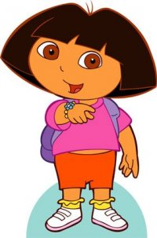

# Счётные множества и другие бесконечности. Решение интересных задачек {#other_infinities}

Конспект: Дуров Илья

дата: 09 сентября 2016
\newcommand{\E}{\mathbb{E}}

## Задача №1 (1.3 в задачнике) "Captain Nemo problem"


### Условие задачи: 
Вражеская подводная лодка находится где-то на числовой прямой (рассматриваем только целые координаты). Она начинает двигаться в определённом направлении, проходя за минуту целое число точек прямой. Мы не знаем ни её начальной позиции, ни скорости движения вдоль прямой. При этом мы можем запускать торпеды каждую минуту, напрявляя их в любую точку с целой координатой. Если подлодка в этот момент времени находится в этой точке, она подбита и тонет. У нас имеется неограниченное количество времени и торпед для того, чтобы потопить вражескую лодку. 

Необходимо разработать стратегию, которая в конечном счёте гарантирует потопление подлодки.

### Решение:

Заметим, что лодка характеризуется двумя параметрами: стартовой позицией (положение на целочисленной прямой) и скоростью (направлением движения). Таким образом, за счётное число шагов (счётное число единиц времени и потраченных торпед) можно перебрать (обстрелять) все гипотетические положения лодки. 

Графически это можно представить следующим образом:

```{r, "submarine"}
library("ggplot2")
s <- c(0, 1, 1, 0, -1, -1, -1, 0, 1, 2, 2)
v <- c(0, 0, 1, 1, 1, 0, -1, -1, -1, -1, 0)
d <- data.frame(s, v)
  
ggplot(d, aes(s, v)) +
  xlab("Стартовая позиция") +
      ylab("Скорость") +
      xlim(c(-3, 3)) +
      ylim(c(-3, 3)) +
     geom_point(colour="blue") +
  geom_segment(aes(xend = c(tail(s, n = -1), NA), yend = c(tail(v, n = -1), NA)),                             
               arrow=arrow(length = unit(0.3, "cm")))
```


Здесь, например, точке $(0,0)$ соответсвует лодка, стартующая из положения $0$ на целочисленной прямой и двигающаяся со скоростью $0$, то есть стоящая на месте. Поэтому в первый момент времени удобно направить торпеду в эту точку, начав перебор всех вариантов. Пусть дальше стреляем в лодку, соответсвующую точке $(1,0)$: у неё скорость тоже равна $0$, поэтому даже во второй момент времени она останется на стартовой позиции $1$, куда мы и отправим вторую торпеду. И так далее по спирали, как показано на рисунке. Для уверенности, рассмотрим седьмой момент времени (шаг), которому соответсвуюет точка $(-1,-1)$. Стартуя из точки $-1$, за семь секунд эта лодка преодолевает дистанцию в семь единиц, двигаясь влево по числовой прямой. В итоге она оказывается в точке $-8$, куда мы и отправляем торпеду, помогая Капитану Немо победить зловредных врагов.

## Бесконечности бывают разные. 

Градация бесконечных множеств:

Счётное $\rightarrow$ Континуум (например, $\mathcal{R}$ — множество рациональных чисел) $\rightarrow$ Больше континуума (например, множество всех подмножеств $\mathcal{R}$)

## Задача №2 (1.8) "Эта задачка — просто космос"

### Условие задачи:
Назовём две бесконечных вправо последовательности из нулей и единиц «похожими», если они отличаются на конечное количество членов. Это отношение «похожести» разбивает все последовательности на классы похожих последовательностей.

1. Какова мощность множества последовательностей похожих на последовательность из одних нулей?

2. Какова мощность множества классов похожих последовательностей?

### Решение:

1) Для упрощения воспрятия подключим воображение и представим каждую последовательность и похожие на неё в виде созвездий, в которых звёзды объединяются по принципу "похожести" (теперь понятно, почему задачка — космос?). 
Также можно представить в виде графа, где вершины — последовательности, а рёбра между вершинами указывают на наличие похожести этих вершин, причём каждое из созвездий — связный граф.

```{r, "stars"}
library(igraph)
g0 <- sample_gnp(20, 1)
g1<- sample_gnp(15, 1)
par(mfrow=c(1, 2))
plot.igraph(g0, vertex.size = 5)
plot.igraph(g1, vertex.size = 5)

```


Так как по условию, "похожие" — это те последовательности-звёзды, которые отличаются друг от друга на конечное число элементов ($0$ или $1$), то легко понять, что и множество последовательностей "похожих" на последовательноть только из нулей будет не более, чем счётное множество.

2) Теперь повеселее. Главное, что надо понять при решении этого, казалось бы, нетривиального пункта, как раз довольно тривиально: множество всех звёзд представляет собой объединение всех созвездий. Вторая важная вещь — то, что было установленно на одном из предыдущих занятий (вспоминаем Канторовскую диагональную процедуру): множество последовательностей из $0$ и $1$ (звёзд) — несчётно (имеет мощность континуум).

Теперь, когда мы вооружены этими двумя фактами, как Рембо, давайте разберёмся с решением задачи, как и Рембо разбирался с решением своих: предположим, что совездий конечное или счётное число. Но, как известно, объединение счётного или конечного числа счётных множеств (множеств звёзд в каждом созвездии — смотрите первый пункт) тоже счётно, а мы только что установили, что объединение созвездий дает несчётное множество звёзд (космически звучит!). Значит, и множество созвездий представляет собой множество мощности континуум.

Более формальное решение выглядит так:

$B=\{ Ci \}; A = \cup Ci \Rightarrow card A = card (\cup Ci) = континуум  \Leftrightarrow  card B = континуум$

Тут $A$ — множество звёзд, $С$ — множество звёзд в i-ом созвездии, $B$ — множество созвездий. 


## Задача №3 (1.9) "Помоги Даше спасти гномов от дракона" 
 
 

### Условие задачи:
Злобный Дракон поймал бесконечное счётное количество гномов. Расставил их в шеренгу так, что первый видит всех остальных, второй — всех, начиная с третьего гнома и так далее. Затем Дракон надевает каждому гному либо чёрный, либо белый колпак. Гномы одновременно пытаются угадать цвет своего колпака. Не угадавшие цвет своего колпака гномы съедаются Драконом. 

Есть ли у гномов стратегия, позволяющая им иметь конечные боевые потери при встрече с Драконом?

### Решение:

Решение задачи с нуля может показаться довольно сложным, но у нас на самом деле есть мощный инструмент — выводы из предыдущей задачи. 
Итак, у нас есть счётное число гномов, которые увидели подлетающего Дракона, промышляющего надеванием колпаков. Эти гномы знют, что колпаки бывают двух цветов — чёрного и белого, поэтому последовательность из белых и чёрных колпаков (надетых на головы бедных гномов) является последовательностью абсолютно эквивалентной последовательности из нулей и единиц, как рассмотренная последовательность в предыдущей задаче.
Что же мешает нам посоветовать гномам заранее определить представительскую последовательность в каждом классе похожих последовательностей (главную звезду в созвездии похожих звёзд колпаков) и угадывать свой цвет, согласно ей?

Ниже представлен пример визуализации выбора представительской последовательности в классе похожих последовательностей (красная вершина — выбранная последовательность):

```{r, "hats"}
library(igraph)
g3 <- sample_gnp(10, 1)
plot.igraph(g3,layout=layout_as_star,
            vertex.color=c("red", rep("NA", length(V(g3)) - 1)))

```

Тогда каждый гном будет видеть цвета колпаков своих стоящих впереди друзей и сможет определить класс, к которому принадлежит реальная последовательность колпаков (определённая Драконом при расдаче колпаков). Так как эта последовательность "похожа" на выбранную гномами в качестве представительской, то она будет отличаться от неё на конечное число колпаков. Значит, гадая согласно выбранной последовательности, лишь конечное число гномов (бедняги) назовут свои цвета неправильно. 


## Задача №4 "И Деды Морозы бывают хитрыми" (картинка с Жебером)
 

### Условие задачи:
Дед Мороз пришёл к детишкам на Новый Год с мешком, в котором находится счётное количество пронумерованных конфет. Конфеты можно есть только после наступления Нового Года. Ровно за минуту до Нового Года Дед Мороз выдаёт детишкам конфеты номер $1$ и $2$ и тут же забирает конфету номер $1$ обратно. Ровно за полминуты — выдаёт конфеты номер $3$ и $4$ и забирает конфету номер 2. Ровно за четверть минуты — выдаёт конфеты номер $5$ и $6$ и забирает конфету номер $3$. И так далее, ускоряясь, выдаёт из мешка две очередные конфеты и забирает у детишек конфету с наименьшим номером.

1. На сколько изменяется количество конфет у детишек за одну операцию дарения-забирания?

2. У кого к Новому Году окажется конфета номер $1$?

3. У кого к Новому Году окажется конфета номер $2016$?

4. Сколько конфет будет у детишек к Новому Году?

### Решение:

1) Первый вопрос — для понимания, но с подвохом для дальнейших расуждений: за одну операцию Дед Мороз дарит две конфеты и забирает одну, следовательно, количество конфет у детей меняется на 1 за одну операцию, причём конфет становится на одну больше.

2) Этот вопрос тоже не сложен, но играет важную роль в дальнейшем понимании: Дед Мороз забирает первую конфету у детей ещё при первой операции, значит, в итоге она остаётся у него.

3) Вот здесь будет посложнее: казалось бы времени до Нового года так мало, всего минута, а Дед Мороз должен успеть выдать $2016$-ую конфету и забрать её. Для упрощения понимания давайте построим таблицу:

| Минут до Нового Года | ДМ выдал | ДМ забрал | У детей |
| ------------------- | ------- | --------- | ------- |
| $1$ | $1; 2$ | $1$  | $2$ | 
| $\frac{1}{2}$ | $3; 4$ | $2$ | $3; 4$ |   
| $\frac{1}{4}$ | $5; 6$ | $3$ | $4; 5; 6$ |
| $\frac{1}{8}$ | $7; 8$ | $4$ | $5; 6; 7; 8$ | 
| $\frac{1}{16}$| $9; 10$ | $5$ | $6; 7; 8; 9; 10$ |

На первый взгляд может показаться, что количество конфет у детей по мере приближения к Новому Году растёт — это же говорит нам и ответ на первый пункт ($+1$ за операцию). Однако можно заметить, что пятую конфету Дед Мороз забирает у детей на пятой операции за $\frac{1}{16} (\frac{1}{16} = \frac{1}{2^4})$ минуты до праздника. Точно так же можно определить номер операции и оставшееся до Нового Года время для $2016$-ой конфеты: она будет забрана у детей на $2016$-ом шаге за $\frac{1}{2^{2015}}$ минуты до торжества. Дело в том, что моменты времени (доли минуты) представляют множество рациональных чисел, которое, как известно, счётно (было установлено на первом занятии), а не конечно, как привычно считать в обыденности.

4) Этот факт помогает понять то, что мы с точностью можем назвать момент времени (минут до Нового Года), когда будет забрана $n$-ая конфета: 

$Tn=\frac{1}{2^{n-1}}$, где $T$ — момент времени забирания кофеты с номером $n$.

Формализируем наше решение: 
Пусть $A_i$ — множество конфет у детей сразу после $i$-ой операции дарения-забирания. Тогда нетрудно увидеть (смотрите таблицу), что $card A_i = i$. При этом $\{A_i\}$ — возрастающая последовательность (как и было показано в пункте $1$ и таблице). Следовательно, $\lim_{i\to\infty} card A_i = \infty$.

Однако физически этот предел означет, сколько конфет будет у детей за мгновение до праздника. Но после этого мгновения наш сверхсветовой Дед Мороз всё ещё будет продолжать своершать свои хитрые операции. То есть нам надо узнать размер множества $A_i$ на очень отдалённом шаге. Чтобы это понять, необходимо проследить за каждой конфетой — определить, будет ли она входить в это отдалённое множество. Иначе говоря: будет ли она когда-нибудь забрана Дедом Морозом. Но нам известно, что для каждой конфеты можно определить момент её забирания, это множество останется пустым, а его размерность — нулевой.

$\lim_{i\to\infty} A_i = \emptyset  \Rightarrow card (\lim_{i\to\infty} A_i) = 0$.

То есть в Новый Год все конфеты окажутся у Деда Мороза (хотя такими действиями он порочит это имя)

## Бонус

После хорошего занятия, можно сделать маленькую передышку и посмотреть видео, которое скорее всего послужило основой задачи про Деда Мороза:

 [Никакого праздника](https://www.youtube.com/watch?v=P5EG9A26tL8)
