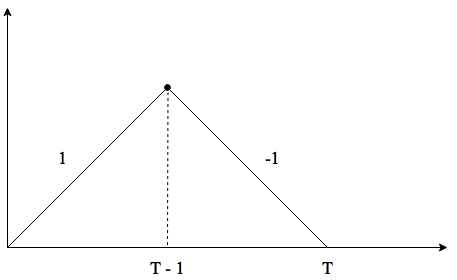

# Условное математическое ожидание от сигма--алгебры  {#condition_on_algebra}

Конспект: Ксения Кинякина

дата: 7 октября 2016 г

Немного о работе с Rmarkdown прежде чем перейти к делу.

Возможно, у вас возникнет необходимость или личное желание нарисовать что-либо в Rmarkdown. Для этого можно использовать такие прекрасные tools, как:

* [Draw.io](https://www.draw.io/)

* [Inkscape](https://inkscape.org/en/)

* [GeoGebra](https://www.geogebra.org/)

* [Gimp](https://www.gimp.org/)

* [Graphviz](http://www.graphviz.org/)

* $\LaTeX$ + [tikz](http://www.computational-logic.org/content/study/master/documents/softskills_tikz.pdf)

- - -

Тепеть обратимся к *условному математическому ожиданию*. 

Стоит напомнить, что $E(X|\mathcal{F})$ --- это наилучший прогноз $X$, если мы различаем события из $\sigma$-алгебры, согласно интуитивному определению.

## Задание №1

### Условия задачи:

Пусть даны случайные величины $X$, $Y$ и вероятности их совместного наступления:

| $(X, Y)$ |  $0$  |   $4$ |
|:-----:|:---:|:---:|
| **$1$** |$a = 0.1$ |$b = 0.2$ |
| **$2$** |$c = 0.2$ |$d = 0.5$ |

и дана $\sigma$--алгебра $\mathcal{F} = \{ \{a\} , \{b, c, d\}, \varnothing, \Omega \}$.

Необходимо найти:

a.  

      a.1.  $E(X|\mathcal{F})$

      a.2.  $E(Y|\mathcal{F})$
    
      a.3.  $E(XY|\mathcal{F})$
    
    
b.  $\mathcal{H} = \sigma(Y)$

c.  

    c.1.  $E(X|\mathcal{H})$

    c.2.  $E(Y|\mathcal{H})$
    
d.  $\mathcal{A} = \{ \varnothing, \Omega \}$
    
    d.1.  $E(X|\mathcal{A})$

    d.2.  $E(Y|\mathcal{A})$
    
e.  $\mathcal{K} = \sigma(X, Y)$
    
    e.1.  $E(X|\mathcal{K})$

    e.2.  $E(Y|\mathcal{K})$
    
- - -

### Решение:

Для начала приведём таблицу в более удобный для решения вид:

|$\Omega$|  $a$  |  $b$  |  $c$  | $d$   |
|:------:|:---:|:---:|:---:|:-----:|
|  **$X$** |  $1$  |  $1$  |  $2$  | $2$   |
|  **$Y$** |  $0$  |  $4$  |  $0$  | $4$   |
| **$Pr$** | $0.1$ | $0.2$ | $0.2$ | $0.5$ |

Освежим в памяти смысл $E(X|{a})$: это математическое ожидание $X$, если нам известно, что $a$ --- произошло.

a.  

a.1.  Распишем $E(X|\mathcal{F})$ по компонентам.

Исходя из условий, $X$ примет значение 1, если известно $a$ (смотрим в таблице на пересечение столбца $a$ и строки $X$). Поэтому ${E(X|{a}) = 1}$. 

Заданная $\sigma$-алгебра не различает значения $\{b\}, \{c\}, \{d\}$, только "слипшиеся" вместе --- $\{b, c, d\}$. Посчитаем же $E(X|\{b, c, d\})$: для этого нам потребуется таблица. Вероятность наступления $b$ среди событий $b, c, d$: $\frac{0.2}{(0.2+0.2+0.5)}$ --- это доля наступления $b$, рассуждая интуитивно. Аналогично для $c$ и $d$: $\frac{0.2}{(0.2+0.2+0.5)}$ и $\frac{0.5}{(0.2+0.2+0.5)}$, соответсвенно. Таким образом,
$E(X|\{b, c, d\}) = 1\frac{0.2}{(0.2+0.2+0.5)} + 2\frac{0.2}{(0.2+0.2+0.5)} + 2\frac{0.5}{(0.2+0.2+0.5)} = 1\frac{2}{9} + 2\frac{2}{9} + 2\frac{5}{9} = \frac{16}{9}$

В нашу таблицу можно добавить еще одну строку:

|$\Omega$|  $a$  |  $b$  |  $c$  | $d$   |
|:------:|:---:|:---:|:---:|:-----:|
|  **$X$** |  $1$  |  $1$  |  $2$  | $2$   |
|  **$Y$** |  $0$  |  $4$  |  $0$  | $4$   |
| **$Pr$** | $0.1$ | $0.2$ | $0.2$ | $0.5$ |
| **$E(X|\mathcal{F})$** | $1$ | $\frac{16}{9}$ | $\frac{16}{9}$ | $\frac{16}{9}$ |

- - -

a.2.  Аналогичны рассуждения для $E(Y|\mathcal{F})$, запишем сразу в таблицу:

|$\Omega$|  $a$  |  $b$  |  $c$  | $d$   |
|:------:|:---:|:---:|:---:|:-----:|
|  **$X$** |  $1$  |  $1$  |  $2$  | $2$   |
|  **$Y$** |  $0$  |  $4$  |  $0$  | $4$   |
| **$Pr$** | $0.1$ | $0.2$ | $0.2$ | $0.5$ |
| **$E(X|\mathcal{F})$** | $1$ | $\frac{16}{9}$ | $\frac{16}{9}$ | $\frac{16}{9}$ |
| **$E(Y|\mathcal{F})$** | $0$ | $\frac{28}{9}$ | $\frac{28}{9}$ | $\frac{28}{9}$ |

- - -

a.3.  Случай $E(XY|\mathcal{F})$ разберём более подробно. $XY$ примет значения $0, 4, 0, 8$. То есть, вектор $X = (1, 1, 2, 2)$, вектор $Y = (0, 4, 0, 4)$, отсюда получаем, что вектор $XY = (0, 4, 0, 8)$.

|$\Omega$|  $a$  |  $b$  |  $c$  | $d$   |
|:------:|:---:|:---:|:---:|:-----:|
|  **$X$** |  $1$  |  $1$  |  $2$  | $2$   |
|  **$Y$** |  $0$  |  $4$  |  $0$  | $4$   |
|  **$XY$** |  $0$  |  $4$  |  $0$  | $8$   |
| **$Pr$** | $0.1$ | $0.2$ | $0.2$ | $0.5$ |
| **$E(X|\mathcal{F})$** | $1$ | $\frac{16}{9}$ | $\frac{16}{9}$ | $\frac{16}{9}$ |
| **$E(Y|\mathcal{F})$** | $0$ | $\frac{28}{9}$ | $\frac{28}{9}$ | $\frac{28}{9}$ |

$E(X|\mathcal{F})$, как мы уже знаем, разбивается на два случая: $E(X|\{a\})$ и $E(X|\{b, c, d\})$.

$E(X|\{a\}) = 0$, так как значению $a$ в векторе $XY$ соответсвует $0$.

$E(X|\{b, c, d\}) = 4\frac{0.2}{(0.2+0.2+0.5)} + 0\frac{0.2}{(0.2+0.2+0.5)} + 8\frac{0.5}{(0.2+0.2+0.5)} = 4\frac{2}{9} + 0\frac{2}{9} + 8\frac{5}{9} = \frac{48}{9}$.

Таблица, в свою очередь, примет вид:

|$\Omega$|  $a$  |  $b$  |  $c$  | $d$   |
|:------:|:---:|:---:|:---:|:-----:|
|  **$X$** |  $1$  |  $1$  |  $2$  | $2$   |
|  **$Y$** |  $0$  |  $4$  |  $0$  | $4$   |
|  **$XY$** |  $0$  |  $4$  |  $0$  | $8$   |
| **$Pr$** | $0.1$ | $0.2$ | $0.2$ | $0.5$ |
| **$E(X|\mathcal{F})$** | $1$ | $\frac{16}{9}$ | $\frac{16}{9}$ | $\frac{16}{9}$ |
| **$E(Y|\mathcal{F})$** | $0$ | $\frac{28}{9}$ | $\frac{28}{9}$ | $\frac{28}{9}$ |
| **$E(XY|\mathcal{F})$** | $0$ | $\frac{48}{9}$ | $\frac{48}{9}$ | $\frac{48}{9}$ |

- - - 

По сути, на этом разбор данного задания заканчивается. Однако решение остальных пунктов всё же приведено ниже с оговоркой: оно было сверено, но достоверно не проверено. 

- - -

b.  $\mathcal{H} = \sigma(Y) = \{\{a, c\}, \{b, d\}, \varnothing, \Omega \}$.

- - -

c.

c.1.  $E(X|\mathcal{H}) = E(X|\{a, c\}) +  E(X|\{b, d\})$. 

Посчитаем покомпонентно:

$E(X|\{a, c\}) = 1\frac{0.1}{(0.1+0.2)} + 2\frac{0.2}{(0.1+0.2)} = \frac{5}{3}$

$E(X|\{b, d\}) = 1\frac{0.2}{(0.2+0.5)} + 2\frac{0.5}{(0.2+0.5)} = \frac{12}{7}$

Таблица примет вид:

|$\Omega$|  $a$  |  $b$  |  $c$  | $d$   |
|:------:|:---:|:---:|:---:|:-----:|
|  **$X$** |  $1$  |  $1$  |  $2$  | $2$   |
| **$Pr$** | $0.1$ | $0.2$ | $0.2$ | $0.5$ |
| **$E(X|\mathcal{H})$** | $\frac{5}{3}$ | $\frac{12}{7}$ | $\frac{5}{3}$ | $\frac{12}{7}$ |

c.2.  Механизм решения для $E(Y|\mathcal{H})$ аналогичный. Запишем ответ в таблицу: 

|$\Omega$|  $a$  |  $b$  |  $c$  | $d$   |
|:------:|:---:|:---:|:---:|:-----:|
|  **$X$** |  $1$  |  $1$  |  $2$  | $2$   |
|  **$Y$** |  $0$  |  $4$  |  $0$  | $4$   |
| **$Pr$** | $0.1$ | $0.2$ | $0.2$ | $0.5$ |
| **$E(X|\mathcal{H})$** | $\frac{5}{3}$ | $\frac{12}{7}$ | $\frac{5}{3}$ | $\frac{12}{7}$ |
| **$E(Y|\mathcal{H})$** | $0$ | $4$ | $0$ | $4$ |

- - - 

d.  $\mathcal{A} = \{ \varnothing, \Omega \}$

d.1.  $E(X|\mathcal{A}) =$ так как $X$ не зависит от $\mathcal{A} = E(X) = 1(0.1+0.3) + 2(0.2+0.5) = 1.7$

d.2.  $E(Y|\mathcal{A}) =$ так как $Y$ не зависит от $\mathcal{A} = E(Y) = 0(0.1+0.2) + 4(0.2+0.5) = 2.8$

- - -

И наконец...

e.  $\mathcal{K} = \sigma(X, Y)$ --- все подмножества $\Omega$.
    
e.1.  $E(X|\mathcal{K}) = X$, так как $X$ --- измерима относительно $\mathcal{K}$.

e.2.  $E(Y|\mathcal{K}) = Y$, так как $Y$ --- измерима относительно $\mathcal{K}$.
    
Итак, первое задание разобрано полностью. Хочется верить, что лапши на уши навешано не было.
    
- - -

## Задание №2

### Условия задачи:

Это задание --- продолжение задачи $2.39$ из задачника. Ниже вкратце изложены условия:

$\mathcal{S_n}$ --- симметричное случайное блуждание, то есть $\mathcal{S_n} = X_1 + X_2 + ... + X_n$, где $X_n$ --- независимые и одинаково распределённые случайные величины с вероятностью $P(X_n = 1) = P(X_n = −1) = 0.5$. Пусть $T$ --- время второго локального максимума $+1$. Определены следующие $\sigma$--алгебры: $\mathcal{F_n} = \sigma(X_1, X_2, ..., X_n)$ и $\mathcal{F_T}$ --- все события $X_i$, которые могут быть распознаны до момента $T$.

Необходимо найти:

a.  $E(X_{T-3}|\mathcal{F}_T)$

b.  $E(T|\sigma(T))$

c.  $E(X_T|\sigma(T))$

d.  $E(S_T|\sigma(T))$

- - -

### Решение:

Напомним, что $\sigma(T)$ --- знание момента времени второго локального максимума $+1$, а $\mathcal{F_T}$ --- все события $X_i$, которые могут быть распознаны до момента второго локального максимума $+1$.

a.  $E(X_{T-3}|\mathcal{F}_T)$: событие $X_{T-3}$ --- измеримо относительно $\sigma$--алгебры $\mathcal{F}_T$, поэтому $E(X_{T-3}|\mathcal{F}_T) = X_{T-3}$.

- - -

b.  $E(T|\sigma(T))$: аналогично с пунктом a. $T$ --- измерима относительно $\sigma(T)$, поэотму $E(T|\sigma(T)) = T$.

- - -

c.  $E(X_T|\sigma(T))$: так как в $\sigma(T)$ содержится информация о моменте $T$, который, грубо говоря, означает переход с $1$ на $-1$, то $E(X_T|\sigma(T)) = -1$.

Наглядное изображение:

- - -

d.  Не будем создавать интригу и сразу дадим ответ: $E(S_T|\sigma(T)) = 0$.

Алгоритм решения заключается в кропотливом переборе всех возможных комбинаций $S_T$ при каждом значении $T$. Например, при разобранном нами значении $T=17$ $(S_T|T=17)$ будет принимать значения 
$\pm{13}, \pm{11}, \pm{9}, \pm{7}, \pm{5}, \pm{3}, \pm{1}$. 

- - -

На этом разбор упражнений заканчивается. Как приятный бонус, определим условное математическое ожидание от $\sigma$--алгебры формально.

## Определение условного математического ожидания от сигма--алгебры:

*Если $E(|X|) < \infty$, то можно определить $E(X|\mathcal{F})$.*

*$E(X|\mathcal{F})$ --- это случайная величина $\hat{X}$, обладающая следующими свойствами:*

*1.  $\hat{X}$ измеримо относительно $\sigma$--алгебры $\mathcal{F}$, то есть, зная информацию из $\mathcal{F}$, можно определить $X$.*

*2.  $E(\hat{X}) = E(X)$.*

*3.  Если взять любую $\mathcal{F}$--измеримую случайную величину $Z$, то окажется, что $cov(Z, X) = cov(Z, \hat{X})$.*

- - -

Зачастую в задачах данного курса встречается много разных замечательных персонажей, будь то Маша с грибами, Петры с Николаями, злобный Дед Мороз, Дракон с гномами или Виноградная улитка. Для интуитивной интерпретации представленного выше определения, придумаем простого мальчика Васю. Он знает, произошли ли события из $\mathcal{F}$. Мальчик Вася также может посчитать $\hat{X}$ (свойство 1), Вася умеет считать $E(\hat{X})$ и $E(X)$ (свойство 2), кроме того, мальчик Вася не отличает $X$ от $\hat{X}$, если он может считать только ковариации (свойство 3).

- - -

Идём дальше.

## Определение геометрий случайных величин:

Для случайных величин, помимо всего прочего, можно определять геометрии. **У случайных величин есть длина, а между двумя случайными величинами можно определить угол!** 

Для решения следующих упражнений, дадим определение двум геометриям:

|$№$|  $Г_1$  |  $Г_2$  |
|:---:|:---:|:---:|
|  **$dist(X,Y)$** |  $\sqrt{E((X-Y)(X-Y))}$  |  $\sqrt{Var(X-Y)}$  |
| **$cos(X,Y)$** | $\frac{E(XY)}{dist(0, X)dist(0, Y)}$ | $\frac{cov(X, Y)}{\sigma_{X}\sigma_{Y}}$ |
|**$<X, Y>$**|$E(XY)$|$Cov(X, Y)$|

Упражнения же на геометрии случайных величин будут разобраны в следующем конспекте.

- - - 

## Дружеские рекомендации:

1.  В процессе работы над конспектом часто приходится использовать специальные символы, которые в Rmarkdown записываются достаточно громоздко. Например, за символом $\mathcal{F}$ скрывается вот такой крокодильчик: `$\mathcal{F}$`. Согласитесь, каждый раз набивать руками подобные символы не столь приятно. Гораздо удобнее копировать из заранее созданного файла, в который ~~ленивый~~ студент добавляет специальные символы по мере написания конспекта. И оттуда же берёт уже единожды введёное руками. 

2.  А вы набивали макет для таблицы самостоятельно? Если _ещё_ нет, то этот [генератор таблиц](http://www.tablesgenerator.com/markdown_tables) облегчит вашу участь.
