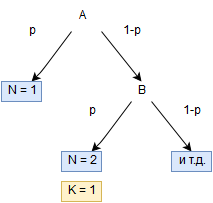

#Условное математическое ожидание {#zadachki}

Конспект: Мартыненко Маргарита

дата: 21 октября 2016 

Решим несколько задачек, чтобы лучше понять: что же за зверь такой, это условное математическое ожидание! 


## Задача № 1 (8.71 в задачнике) {#zadacha1}

### Условие задачи {#uclz}

Известно: 

* $Y = X cos(X) + Z$, где $X \sim N(0,10), Z \sim U[0;30]$ 

* $X$ и $Z$ независимы

Найдите:

$E(Y|X)$, $E(Y|Z)$

### Решение задачи {#reshzad}

#### Найдём $E(Y|X)$ {#p1}


$E(Y|X) = E((X cos(X) + Z)|X))$ 

Математическое ожидание суммы — сумма математических ожиданий. Тогда:

$E((X cos(X)+Z)|X)) = E(X cos(X)|X) + E(Z|X)$

Рассмотрим оба слагаемых по отдельности:

1. Зная $X$, мы можем идеально точно спрогнозировать, чему будет равен $X cos(X)$:

$E(X cos(X)|X) = X cos(X)$

2. Мы можем поменять условное математическое ожидание на безусловное, так как $X$ и $Z$ — независимые случайные величины: 

$E(Z|X) = E(Z)$

Учитвая пункты 1 и 2, получаем: 

$E(X cos(X)|X) + E(Z|X) = X cos(X) + E(Z)$, причём \[E(Z) = \frac{0+30}2 = 15,\]

т.к. $Z$ — равномерно распредлённая случайная величина на отрезке $[0;30]$.

Тогда конечный ответ: 

$X cos(X)+15$


#### Найдём $E(Y|Z)$ {#p2}

$E(Y|Z)$ = $E((X cos(X) + Z)|Z)$ = $E(X cos(X)|Z)$ + $E(Z|Z)$

Снова рассмотрим отдельно оба слагаемых. 

1. Очевидно, что зная $Z$, мы можем идеально точно спрогнозировать $Z$: 

$E(Z|Z)$ = $Z$

2. Мы знаем, что $X$ и $Z$ — независимы. Можно ли утверждать, что $cos(X)$ тоже независим от $Z$? Правильный ответ: да, можно. Тогда условное математическое ожидание мы можем заменить на безусловное: 

$E(X cos(X)|Z) = E(X cos(X))$

Случайные величины $X$ и  $cos(X)$ — зависимые: зная $X$, можно уверенно сказать, чему равен $cos(X)$. Поэтому мы не можем рассматривать математическое ожидание произведения случайных величин как произведение математических ожиданий. 

Честно посчитаем $E(X cos(X))$:

\[
E(X cos(X))$ = \int_{-\infty}^{\infty} X cos(X) f(X)\,dx
\qquad\]


Как выглядит функция плотности $f(x)$?


\[
f(x) = \frac1{\sigma \sqrt{2 \Pi}} e^{-\frac{(X-\mu)^2}{2 \sigma^2}}
\]
 
Пусть

\[
h(X) =  X cos(X) f(X)
\]

Что мы можем сказать о $h(X)$: чётная или нечётная функция?  

\[
h(-X) = -X cos(-X) f(-X)
\]

Мы знаем, что:

\[cos(-X) = -X\]

Кроме того, так как мы имеем дело с нормальным распределением:

\[f(-x) = f(x),\]

тогда: 

\[h(x) = -X cos(x) f(X) = -h(X).
\]

То есть функция $h(X)$ — нечётная! 

Функция $h(X)$, конечно, неприятная, но она нечётная. График функции будет похож на график $Y = X cos(X)$. Единственное отличие: $f(X)$ будет очень быстро убывать, поэтому при стремелении к плюс и минус бесконечности $h(x)$ сходится к нулю, то есть сильнее "прижимается" к оси $X$. Поэтому набросаем график $Y = X cos(X)$: 


```{r, "graphik"}

curve(cos(x)*x, -10, 10)
abline(h = 0, v = 0 )

```


График симметричен относительно 0. Поэтому площадь под графиком будет равна 0. И наш, казалось бы, страшный интеграл от $h(X)$ равен 0. (А теперь представьте, что вы в танке, и попробоуйте взять этот интеграл в лоб. Берётся ли он?)

Итак, конечный ответ: 0.


#### Маленькое дополнительное задание {#dop}
 
Пусть $z \sim N(0,7)$. Чему равно $E(z^7)$?

Правильный ответ: $E(z^7) = 0$. Почему? Потому что степень при $z$ нечётная. 

Для чётных степеней это не работает! Например:

\[ 
E(z^2) = var(z) + E^2(z) = 7 + 0 = 7 \]

Для четвёртой степени почитать уже сложнее, но тоже можно.

## Задача № 2 (8.68 в задачнике) {#zadacha2}
 
### Условие задачи (перевод с английского) {#usl2}

Случайные величины $X_1$, $X_2$... — независмые и равномерно распределённые на отрезке $[0;1]$. Мы суммируем их, пока не добавляется первый $X_i$, который больше 0.5. После этого мы останавливаемся. Пусть $S$ — полная сумма и $N$ — номер первого $X_i$ больше 0.5. Найдите $E(S|N)$, $Var(S|N)$, $E(S)$, $Var(S)$.

### Нужна сказка, чтобы лучше понять условие! {#drugoe}

Рыбак Иван Петрович ловит карасей. Если карась меньше чем полметра, Ивану Петровчу нечем хвастаться, поэтому он продолжает ловить карасей. Он спокойно уходит домой только тогда, когда наконец на крючок попадается карась длиной больше, чем полметра. Тогда $S$ — общий вес всех пойманных карасей. 


### Решение задачи {#reshh}

#### $E(S|N)$ {#mato}

$E(S|N) = E(X_1 + ... +X_N|N) = E(X_1 + ... +X_{N-1})|N) + E(X_N|N)$

По условиям задачи:

При известном $N$ $X_1 ... X_{N-1} \sim U[0;0.5]$, т.к. первые $N - 1$ карасей меньше $0.5$ м.

При известном $N$ $X_N \sim U[0.5;1]$, т.к. последний карась не меньше $0.5$ м.

Помним, что 

Тогда:

\[
E(X_1 + ... +X_{N-1}|N) + E(X_N|N) = \frac{0.5 + 0}{2} (N-1) + \frac{1 + 0.5}{2} = \frac{1}{4} N + \frac{1}{2}
\]

#### $Var(S|N)$ {#var}

При фиксированном $N$ все $X_i$ условно независимые: мы не можем сказать, чему равно $X_i$, зная любой другой $X$. Для условно независимых случайных величин условная дисперсия суммы равна сумме условных дисперсий. Тогда: 

\[ 
Var(S|N) = (N-1) \frac{(0.5 - 0)^2}{12} + \frac{(1 - 0.5)^2}{12} = N \frac{0.25}{12} = \frac{N}{48}
\]


#### $E(S)$ и $Var(S)$ {#mat2}

\[
E(S) = E(E(S|N)) = E(\frac{1}{4} N +\frac{1}{2}) = \frac1{4} E(N) + \frac1{2} \]

\[
Var(S) = E(Var(S|N)) + Var(E(S|N)) = E(\frac{N}{48}) + Var(\frac1{4} N) = \frac1{24} + \frac1{16} Var(N)
\]

Итак, нам нужно найти $E(N)$ и $Var(N)$.

$N$ распределено геометрически. Напомним, что геометрическое распределение — распределение дискретной случайной величины равной количеству испытаний случайного эксперемента до наблюдения первого "успеха". Вероятность "успеха" — $p = 0.5$, так как равновероятно рыбаку может попасться карась длиной меньше 0.5 метра и карась длиной больше 0.5 метра. Тогда:

\[ 
E(N) = \frac1{p} = \frac1{0/5} = 2
\]

\[Var(N) = \frac{p}{q^2} = \frac{0.5}{0.5^2} = 2
\]

Теперь можем получить окончательные ответы: 

\[ E(S) = \frac1{4} 2 + \frac1{2} = 1 
\]

\[ Var(S) = \frac1{24} + \frac1{16} 2 = \frac1{6} \]


#### Если вы забыли, чему равно математическое ожидание и дисперсия случайной величины, распределенной геометрически, не отчаивайтесь! {#dopp}

Вывести $E(N)$ и $Var(N)$ не так уж сложно.

Рассмотрим на примере $E(N)$. 

Игру можно представить следующим образом. На каждом шаге есть два вероятных исхода: "успех наступает" и "успех не наступает". Рассмотрим первый шаг. С вероятностью $p$ успех наступает, то есть $N = 1$. С вероятностью $1-p$ успех не наступает, мы переходим в следующую точку, игра как бы начинается заново. 



$N$ — число шагов, если старт в точке $A$. 

$K$ — число шагов, если старт в точке $B$.

Заметим, что в точке $B$ мы будто начинаем игру заново, поэтому: 

\[ E(K|старт B) = E(N|старт A) \]
 

Учитывая всё вышесказанное:

\[ E(N) = p \cdot 1 + (1 - p) E(N|стартB) \]

\[ E(N|стартB) = 1 + E(K|стартB) = 1 + E(N|стартA) = 1 + E(N) \]

Тогда: 

\[ E(N) = p + (1-p) (1 + E(N)) \]

Решаем уравнение и находим $E(N)$: 

\[ E(N) = \frac1{p} \]

Аналогичным образом можно вывести $E(N^2)$ и посчитать $Var(N)$ используя известную формулу: 

\[ Var(N) = E(N^2) - E^2(N) \]

### Маленькое дополнение :)  {#minidop}

Если вам нужно быстро набрасать график, а **$R$** под рукой почему-то нет, вы можете использовать http://www.nigma.ru/. 


