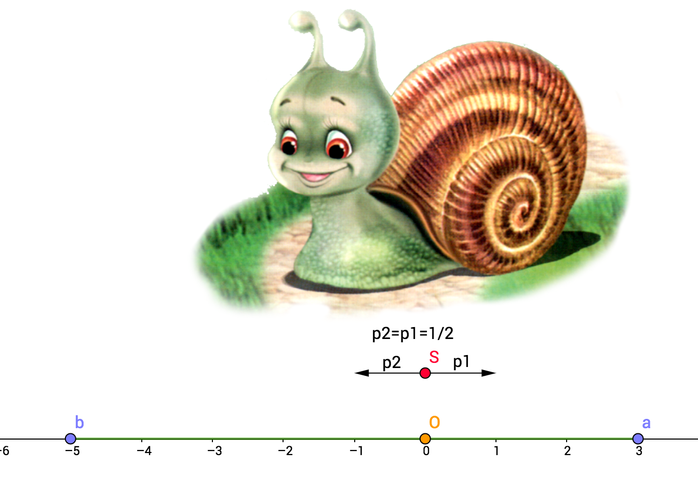

# Теорема об остановке мартингала (теорема Дуба) {#Doob_section}

Конспект: Шебзухова Дарина

дата: 11 ноября 2016

Пусть $X_t$ — наше благосостояние в справедливой игре в момент времени $t$ или мартингал.

Наша стратегия заключается в том, чтобы в нужный момент завершить игру, скажем, после
крупного выигрыша. Другими словами, наша стратегия определяется моментом остановки $\tau.$
Этот момент остановки — случайная величина, так как может зависеть от хода игры. 

Случайной величиной является также и $X_\tau$ — выигрыш на момент выхода из игры. Вопрос в том, чему равен средний выигрыш на момент прекращения игры, $E(X_\tau)$?

Ответ даёт теорема Дуба: Если не ждать «слишком» долго, то каким бы хитрым ни был
момент остановки, ожидаемый выигрыш будет равен начальной сумме: $E(X_\tau ) = E(X_1).$

## Пример не мартингала.{#Doob_subsection_1}

Сразу приведём пример «слишком» долгого ожидания: ждать до выигрыша в один рубль
в классическом случайном блуждании. 
Условие $E(X_\tau ) = E(X_1)$ здесь нарушено: выигрыш на момент выхода из игры равен одному рублю (по построению), а стартовая сумма равна нулю. 
Почему это слишком долгое ожидание? Потому, что в этом случае можно доказать, что $E(\tau) = +\infty$.
Точный смысл понятия «слишком» долго можно увидеть в теореме:

## Теорема 1. {#Doob_subsection_2}

**Если** $Xt$ — мартингал, $\tau$ — момент остановки, и выполнено хотя бы одно из
трёх условий:

1. Момент $\tau$ ограничен, то есть $\exists M: \tau < M$. (Иными словами: гарантированно играем не больше $М$ шагов);

2. $P(\tau < \infty) = 1$  $(P(\tau=+\infty)=0)$ и процесс $X_{t∧\tau}$ ограничен, то есть $\exists M  : \forall t$ $|X_{t∧\tau} | < M.$ 
(момент $\tau$ может быть $\forall$, главное, чтобы сам мартингал был не очень большой — рамки, которые ограничивают процесс);

3. $E(\tau) < +\infty$ и $\exists  M: \forall t$ верно $E(|X_{t+1} −X_t||\mathcal{F}_t) < M$ (процесс сильно "не скачет" за единицу времени);

*Замечание:  в большинстве случаев этих критериев достаточно для практического применения мартингала.*

4. $P(\tau < \infty) = 1$, $E(|X_\tau |) < + \infty$ и $\lim_{t \to \infty}E(X_t|\tau >t) = 0$ — как следствие любого из трёх предыдущих;

5. $P(\tau < \infty) = 1$ и мартингал $X_t$ является равномерно интегрируемым — используется определение равномерной интегрируемости;

**то:** $E(X_{\tau} )$ = $E(X_t)$ и, в частности, $E(X_\tau ) = E(X_1).$

## Обобщая теорему {#Doob_subsection_3}

Если вы не заглядываете в будущее (не можете сказать, что выйдете из игры за минуту до проигрыша), т.е. играете в справедливую игру, то тогда ваш средний выигрыш на момент выхода из игры равен выигрышу в любой момент времени и, кроме того, равен стартовому состоянию.

## Задача 1 [В задачнике — 10.7] {#Doob_subsection_4}

### Условие задачи {#Doob_subsubsection_1}

В начальный момент времени в урне лежит один чёрный и один белый шар. В каждый момент времени из урны наугад извлекается один шар. Вместо одного извлечённого шара в урну кладут два шара такого же цвета.

Пусть $C_n$ — количество, а $M_n$ — доля чёрных шаров после $n$-го шага.
Рассмотрим также величину $B_n$, показывающую, сколько раз из урны доставали чёрный шар к моменту времени $n$, включительно.

1. Как связаны $B_n$ и $C_n$?

1. Докажите, что $M_n$ — мартингал.

1. Найдите $P(C_n = k).$

1. Как распределён $\lim_{n \to \infty}M_n$?

1. Докажите, что для $0 < \theta < 1$ мартингалом будет последовательность $N_n=(n+1)C_n^{B_n} \theta ^{B_n} (1-\theta)^{n-B_n}.$

### Рассмотрим частные случаи:{#Doob_subsubsection_2}

$C_0=1$ — количество чёрных шаров перед первым извлечением шара.

$C_1$ — количество чёрных шаров после первого извлечения шара с соответствующими вероятностями (извлекли либо чёрный либо белый):

$C_1$|                   1                   |                   2                  |
-----|---------------------------------------|--------------------------------------|
p    |                  $\frac12$                  |                  $\frac12$                 |

$C_2$ — количество чёрных шаров после второго извлечения шара с соответствующими вероятностями:

$C_2$|               1             |             2           |          3           |
-----|-----------------------------|-------------------------|----------------------|
p    |           $\frac12  \cdot \frac23$         |       $ 2 \cdot \frac13  \cdot \frac13$   |       $\frac12 \cdot \frac13$      |

Например, для $C_2=2$, то есть когда после второго извлечения в коробке осталось два чёрных шара.

Могло быть:

1. На первом шаге извлекли белый $(p=\frac12).$ В коробке находятся: {Белый, Белый, Чёрный}. Тогда на втором шаге должны были извлечь чёрный $(p=\frac13)$. В коробке: {Белый, Белый,Чёрный, Чёрный} — $(\frac12 \cdot \frac13).$

1. На первом шаге извлекли чёрный $(p=\frac12).$ В коробке: {Белый, Чёрный, Чёерный}. Тогда на втором шаге должны были извлечь белый $(p=\frac13).$ В коробке: {Белый, Белый,Чёрный, Чёрный} — $(\frac12 \cdot \frac13)$

Тогда вероятность последовательности {Белый, Белый,Чёрный, Чёрный}: $2\cdot\frac12\cdot\frac13 = \frac13.$ 
            
Количество чёрных шаров после третьего извлечения шара с соответствующими вероятностями:

$C_3$| 1                  | 2                 | 3                 | 4              |
-----|--------------------|-------------------|-------------------|----------------|
p | $\frac12  \cdot \frac23 \cdot \frac34$  | $\frac12  \cdot \frac23  \cdot \frac14  + 2 \cdot \frac12 \cdot \frac13  \cdot \frac12$ | $\frac12  \cdot \frac23  \cdot \frac14  + 2 \cdot \frac12  \cdot \frac13  \cdot \frac12$  | $\frac12  \cdot \frac23  \cdot \frac34$|

Предположим, что на каком-то шаге $P(C_n=k)=1/(n+1)$ — гипотеза.

$P(C_n=k)= \frac{P(C_n=k-1)\cdot(k-1)}{(n+2)} + \frac {P(C_n=k)\cdot((n+2)-k)}{(n+2)}$ :
либо было уже $k$ чёрных и добавили шарик другого цвета, либо было $(k-1)$ чёрный шар и на последнем шаге добавили ещё один чёрный.

Тогда:
$P(C_n=k) = \frac1{(n+1)}\cdot\frac {(k-1)}{(n+2)}+\frac 1{(n+1)}\cdot \frac{((n+2)-k)}{(n+2)} = \frac {(k-1+n+2-k)}{(n+1)(n+2)}=\frac {(n+1)}{(n+1)(n+2)}=\frac{1}{(n+2)}.$

$M_n$ — доля чёрных шаров после $n$-го изъятия,

$M_1$| $\frac13$  | $\frac23$  |
-----|-----|-----|
p | $\frac12$  | $\frac12$  |

$M_{100}$|      $\frac1{102}$    |     $\frac2{102}$  |             ...            |       $\frac{101}{102}$ |
---------|--------------|-----------|----------------------------|------------------|
p        |    $\frac1{101}$    |     $\frac1{101}$  |             ...            |        $\frac1{101}$      |

Асимптотически напоминает равномерное распределение:
$\lim_{n \to \infty} M_n \sim U [0;1].$

Замечание:

Многие мартингалы сходятся к определённому распределению если их отнормировать.

## Задача 2. [В задачнике — 10.5] {#Doob_subsection_5}

### Условие задачи:{#Doob_subsubsection_1}

Пусть $S_n$ --- симметричное случайное блуждание, $S_0 = 0$.
Верно ли, что $Z_n = (−1)^n\cdot\cos(\Pi\cdot S_n)$ --- мартингал?

### Решение задачи:{#Doob_subsubsection_2}
Вспомним особенности функции $\cos:$

$\cos(0) = 1$

$\cos(\Pi) = -1$

$\cos(2\cdot\Pi) = 1$

$\cos(3\cdot \Pi) = -1$

$S_0 = 0$ ; $S_1 = 1$ ; $S_2 = 0 ; \ldots$

$S_n$ меняет чётность $\Rightarrow$ посещаем $2\cdot k \cdot \Pi$ или $(2k+1)\cdot\Pi$ $\Rightarrow$ 
$\cos(2\cdot k \cdot \Pi ) = 1$ или $\cos((2k+1)\cdot\Pi) = -1$;

$(-1)^n: (-1)^{2k}=1,$ $(-1)^{2k+1} = -1.$

То есть множители всегда одного знака, следовательно, $Z_n=1$ всегда.
Поэтому можно сделать вывод, что $Z_n$ — мартингал. $\checkmark$
 
##Напоминалка:{#Doob_subsection_6}
 
 Говорим, что $Х$ — подбрасывание монетки до первого выпадания "орла" $(Х \sim Geom(p)),$ при этом "орёл" выпадает с вероятностью $p$.
 
 
$X$        |       1          |          2          |       3         |      ...    |
-----------|------------------|---------------------|-----------------|-------------|
$P$        |      $ p $          |       $ p \cdot (1-p)$    |    $p\cdot (1-p)^2$   |      ...    |
 
 $E(X)=\frac1p$ 
 
 $P(X=+\infty)=(1-p)^\infty=0$
 
Заметим, что геометрическое распределение удовлетворяет условиям теоремы Дуба!
 
 
## Задача 3. {#Doob_subsection_7}
(Симметричное случайное блуждание)
 
### Условия задачи:{#Doob_subsubsection_1}
 
Улитка начинает свой путь в точке 0 и за каждую минуту равновероятно смещается влево или вправо на один сантиметр.
  
Справа от улитки на расстоянии $a$ находится виноградное дерево, слева на расстоянии $b$ — шелковица.
  
$X_t$ — координаты улитки после $t$ шагов.

Вопросы:

1. Применима ли теорема Дуба: $\bullet$ $X_t$ — мартингал ли?
$\bullet$  Если $\tau$ — момент "залипания", то является ли $\tau$ моментом остановки?
$\bullet$  $P(\tau=+\infty)=?$ и $E(\tau) \vee +\infty?$

2. Чему равна следующая вероятность $P(X_{\tau}=3)?$

3. Чему равно $E(X_{\tau})$?

4. Является ли мартингалом процесс $Y_t=X_t^2-t?$

5. Является ли мартингалом процесс $\widetilde{Y_t}=\widetilde{X_t}^2-t?$ 

### Решение:{#Doob_subsubsection_2}

Пусть для простоты $а=3$ $b=-5.$

1. Проверка выполнения условий теоремы Дуба:

* $E(X_{t+1}|\mathcal{F}_t)$:

$\bullet$ Если улитка уже залипла на шаге $t$,то $X_t=3$ или $X_t=5$, тогда остаётся и дальше на текущей позиции, т.е. $E(X_{t+1}|\mathcal{F}_t)=X_t.$

$\bullet$ Если после $t$ улитка ползёт направо, то $X_{t+1}=X_t+1$, или если после $t$ она поползёт налево  $X_{t+1}=X_t-1$, то есть на шаге $t$ ещё не произошло залипание, то $E(X_{t+1}|\mathcal{F}_t)=\frac12 \cdot (X_t+1) + \frac12 \cdot(Xt-1)=X_t.$

Следовательно, вне зависимости от того, зависла улитка на предыдущем шаге или нет $E(X_{t+1}|\mathcal{F}_t)=X_t$ $\Rightarrow$ $X_t$ — мартингал. $\checkmark$

* $\tau$ — момент залипания, он действительно ограничен, например, числом $8 \Rightarrow \tau$ —  момент остановки. $\checkmark$

* $P(\tau = +\infty) = ?$ и $E(\tau) \vee +\infty$

$\bullet$ Рассмотрим $P(\tau = +\infty)$:

Есть, вообще говоря, такое $\infty$ количество траекторий, что улитка никогда не залипнет.
Разобьём жизнь улитки на периоды по восемь шагов ("восьмидневки"). Если все восемь дней улитка будет двигаться в одном направлении, то она точно залипнет. Но не факт, что она залипла, если нет такой "восьмидневки".

Вероятность того, что конкретная "восьмидневка" в одну сторону (счастливая восьмидневка): $(\frac12)^8$, 

вероятность того, что конкретная "восьмидневка" **не** в одну сторону (несчастливая восьмидневка): $1-(\frac12)^8.$

Для всех "восьмидневок": $(1-(\frac12)^8)^\infty$ — вероятность того, что все "восьмидневки" — несчастливые.
Тогда $1-(1-(1/2)^8)^\infty \le P("залипла")$ $\Rightarrow$

$P("залипла") \geqslant 1$

$P("залипла") = 1$ 

$P(\tau=+\infty)=0.$ $\checkmark$
 
$\bullet$ $E(\tau) \vee +\infty:$

$\tau \le 8\cdot N1.$

$N1$ — номер 1-ой счастливой восьмидневки, $N1 \sim Geom(1/2).$

$E(\tau) \le 8\cdot E(N1)$

$E(N1)=2^8 \Rightarrow E(\tau) \leqslant 8\cdot 2^8$ — конечное

$E(\tau)$ — ограничено

2. п.1: не применим, т.к. момент залипания не ограничен;

п.2: $|X_{t \wedge \tau|}|<6,$ так как положение улитки ограничено координатами точек "залипания" $\Rightarrow$ пункт применим. $\checkmark$ 

п.3: $E(\tau)$ ограничено (из пункта в).

$|X_{t+1 \wedge \tau}-X_{t \wedge \tau|}|<2$ ( точно меньше двух: если залипнет = 0, если не залипнет, то = 1). $\checkmark$

$\bullet$ $P(X_{\tau}=3)$ — вероятность того, что улитка дойдёт до виноградника.

$E(X_1)=-1\cdot\frac12+1\cdot\frac12=0$

$E(X_\tau)=E(X_1)=0$ (т.к. $X_t$ — мартингал),

тогда $E(X_\tau)= 3\cdotp + (1-p)\cdot(-5)=0$ 

$\Rightarrow 8\cdotp-5=0 \Rightarrow p=\frac58$

$P(X_{\tau}=3)=\frac58$

3. $E(X_\tau)=E(X_1)=0$ (т.к. $X_t$ — мартингал)

4. $Y_t=X_t^2-t?$ — не мартингал:

если залипла, то $X_t^2$ не меняется, а $t$ продолжает меняться.

5. $\widetilde{Y_t}=\widetilde{X_t}^2-t$

$\widetilde{X_t}$ - координаты улитки, если бы не было залипания;

$\bullet$ $E(\widetilde{Y}_{t+1}|\mathcal{F}_t)$=
$E({\widetilde{X}_{t+1}}^2|\mathcal{F}_t)$-
-$(\widetilde{t}+1)|\mathcal{F}_t)$ 
$E(\widetilde{Y}_{t+1}|\mathcal{F}_t)$ = 
=$E((\widetilde{X}_t+\Delta_{t+1})^2)|\mathcal{F}_t)- \widetilde{t}-1$ =
= $E(\widetilde{X}_t^2+2\cdot\widetilde{X}_t\cdot\Delta_{t+1}+{\Delta_{t+1}}^2|\mathcal{F}_t) -\widetilde{t}-1$
${\Delta_{t+1}}^2=1$

$E(\widetilde{Y}_{t+1}|\mathcal{F}_t)$= 
$E(\widetilde{X}_t^2 +2\cdot\widetilde{X}_t\cdot\Delta_{t+1}|\mathcal{F}_t) - \widetilde{t}$=
=$\widetilde{X}_t^2+2\cdot\widetilde{X}_t\cdot E(\Delta_{t+1}|\mathcal{F}_t)) -\widetilde{t}.$
[в силу независимости переходим к безусловному математическому ожиданию]

$E(\Delta_{t+1}|\mathcal{F}_t))=E(\Delta_{t+1})=1/2\cdot(-1)+1/2\cdot1=0$
$E(\widetilde{Y}_{t+1}|\mathcal{F}_t)=$
$\widetilde{X}_t^2-\widetilde{t}=\widetilde{Y}_t.$
$\Rightarrow$ $\widetilde{Y_t}$ — мартингал. $\checkmark$
$\Rightarrow$ можно применить теорему Дуба!

п1: $\tau$ может принимать очень большие значения

п2: $|\widetilde{Y}_{\tau \wedge t}|<m?$

m — конкретное число

$\widetilde{Y}_{\tau \wedge t} = \widetilde{X}_{\tau \wedge t}^2-t\wedge\tau$

$\bullet$ ${\widetilde{X}_{\tau \wedge t}^2}\in [-5;3]^2$

$\bullet$ $t\wedge\tau$ не ограничено.

$|\widetilde{Y}_{\tau \wedge t}|<m$ 

п.3: 

$|\widetilde{Y}_{t+1\wedge\tau}-\widetilde{Y}_{t\wedge\tau}|= |\widetilde{X}_{t+1\wedge\tau}^2-[(t+1)\wedge\tau+t\wedge\tau]-\widetilde{X}_{t\wedge\tau}^2|$

$\widetilde{X}_{t+1\wedge\tau}^2 \leqslant 25$

$\widetilde{X}_{t\wedge\tau}^2 \leqslant 25$ 

$t+1\wedge\tau$ и $t\wedge\tau$ отличаются максимум на 1

$|\widetilde{Y}_{t+1\wedge\tau}-\widetilde{Y}_{t\wedge\tau}| \le 100$ (гарантировано)

$\Rightarrow$ теорема Дуба применяется 

$E(\widetilde{Y}_t) = E(\widetilde{Y}_1)= E(\widetilde{X}_1^2-1)=E(1-1)=0$

$\widetilde{X}_1 = 1 (или = -1)$

$E(\widetilde{X}_\tau^2-\tau)=E(\widetilde{X}_\tau^2)-E(\tau) = 9\cdot\frac58+25\cdot\frac38-E(\tau) = 0$ $\Rightarrow$ 

$E(\tau)=\frac{(45+75)}8=\frac{120}8=15.$

