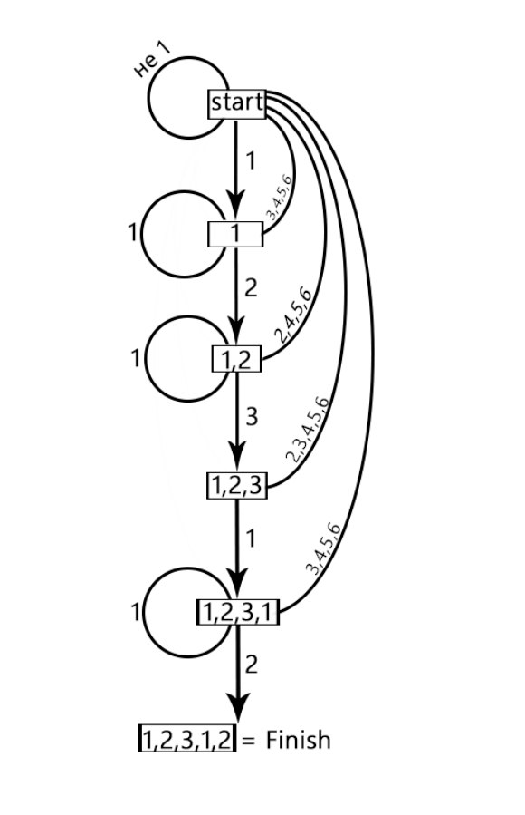
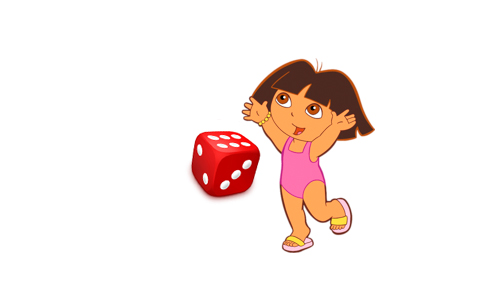
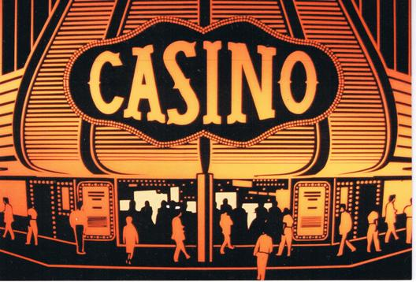

# Мартингалы. Разбор задачи №10.56 {#casino_dice}

Конспект: Решетникова Дарья

дата: 18 ноября 2016
  
## Условие задачи:
  
Игральный кубик подбрасывается бесконечное количество раз. Сколько подбрасываний в среднем пройдёт до появления последовательности 1-2-3-1-2?

### Пояснение
Кубик подбрасывается сколько угодно раз и $T$ — момент первого появления последовательности 1-2-3-1-2. Нам надо найти $E(T)$.

## Существует два способа решения данной задачи. 
### Первый способ: без мартингала

Рассмотрим варианты применительно к этой последовательности. При первом подбрасывании может выпасть 1 и не 1, с вероятностью 1/6 и 5/6, соответственно *(формально может выпасть 2, 3, 4, 5, 6, но это же сколько вариантов!…)*. Если выпало не 1, можем считать, что мы потратили один бросок и, как будто, игра началась сначала *(если выпало, например, 5 – это конечно хорошо, но эта 5 нам ни к селу, ни к городу)*. Нарисуем простое дерево с наименьшим числом ответвлений. 
Если выпало не 1 – скажем, что мы попадаем в исходную ситуацию. 
Если выпало 1, мы попадаем в интересную ситуацию: если выпало 1 – это отбрасывает нас не в начало игры, а на второй шаг: две единицы подряд нам не нужны, но это эквивалентно тому, что выпала одна единица. Если выпало 2 – мы продвигаемся на один шаг дальше, а все остальное (3-4-5-6) отбрасывает нас в начало игры. 
Дальше: если выпало 3 – это то, что нам нужно, и мы продвигаемся ещё на шаг вперед. Если выпало 1, то мы вернёмся на второй шаг, а если 2,4,5,6 – нас отбрасывает снова в начало. И так далее, составим эту схему. *В итоге получится большая схема, составление которой занимает слишком много времени, поэтому всё же лучше пойти через мартингалы.*

*Занумеруем наши узлы. Допустим, стартовый узел будет Нулевым, а дальше кодируем их соответственно с нашей последовательностью для простоты, чтобы не путаться и не вводить лишнюю нумерацию: [1], [1,2], [1,2,3], [1,2,3,1], [1,2,3,1,2] = Финиш*

Получаем следующую схему:

Введём понятие — ожидаемое число ходов из каждой точки — $E(T)$.    
$E_a(T)$ — ожидаемое число ходов до конца игры, если стартовать в точке $a.$

По сути, нам надо найти $E(T)$ от старта, то есть $E_0(T)$, где $E_0(T)$: с вероятностью $\frac16$ мы попадаем в первый узел, а с вероятностью $\frac56$ мы начинаем игру заново, потратив бросок:

$E_0(T) = \frac16 \times (1+E_1(T)) + \frac56 \times (1+ E_0(T))$,   
*где $(1+E_{0/1}(T))$ – мы потратили один бросок и либо продвинулись на один шаг ($E_1(T)$) [нам ещё ждать столько, сколько ждать из первой точки], либо вернулись в начало ($E_0(T)$)*

Выразим $E_1(T)$ через $E_0(T)$. 

Получим:                    
$E_1(T) = E_0(T) – 6$ 
То есть в среднем, чтобы преодолеть эту первую «стрелку» уходит шесть ходов.  
Идея такая: будет ровно столько уравнений, сколько точек, и ровно столько же неизвестных. То есть будут неизвестные: $E_0(T), E_1(T), E_{12}(T), E_{123}(T), E_{1231}(T)$, следовательно, у нас будет пять уравнений и пять неизвестных и все уравнения получаются линейными.   

Продолжим дальше писать уравнение для $E_1(T)$.               
$E_1(T)$: с вероятностью $\frac16$ я попаду опять в эту же точку, в вероятностью $\frac16$ я продвинусь на один шаг и с вероятностью $\frac46$ вернусь в начало.

Соответственно:        
$E_1(T)$ = $\frac16 \times (1+ E_1(T)) + \frac16 \times (1+ E_{12}(T))$ + $\frac46 \times (1+ E_0(T))$  
Выразим отсюда $E_{12}(T)$ через $E_0(T)$.

Далее — по аналогии.   

Выпишем последнее уравнение для $E_{1231}(T)$:
С вероятностью $\frac16$ мы закончим игру за один ход, с вероятностью $\frac16$ мы вернемся в $E_1(T)$ (если выпадет 1) и с вероятностью $\frac46$ нас отбросит в начало   
$E_{1231}(T) = \frac16 \times 1 + \frac16 \times (1+ E_1(T)) + \frac46 \times (1+ E_0(T)).$   

Получаем систему:     

$\cases{E_0(T) = \frac16 \times (1+E_1(T)) + \frac56 \times (1+ E_0(T))\\E_1(T) = \frac16 \times(1+ E_1(T)) + \frac16 \times(1+ E_{12}(T)) + \frac46 \times(1+ E_0(T))\\E_{12}(T) = \frac16 \times(1+ E_{12}(T)) + \frac16 \times(1+ E_{123}(T)) + \frac46 \times(1+ E_0(T))\\E_{123}(T) = \frac16 \times (1+E_{1231}(T)) + \frac56 \times (1+ E_0(T))\\E_{1231}(T) = \frac16 \times 1 + \frac16 \times(1+ E_1(T)) + \frac46 \times (1+ E_0(T))}$

Нам надо найти $E_0(T).$   
Решив систему, получаем ответ: $E_0(T) = 6^5 + 6^2.$      

### Второй способ: с мартингалами

Решая эту задачу с помощью мартингалов, мы пользуемся теоремой Дуба. Нам нужно *так подгадать под теорему Дуба, чтобы она сказала нам чему равен $E(T)$.*   

Цель: надо найти такой мартингал, чтобы $T$ входило в формулу, то есть хочу мартингал вида *"случайная величина минус $t$"*   
Что такое мартингал? Мартингал — это благосостояние игрока в справедливой игре.  

Представим ситуацию:  

Даша подбрасывает кубик в казино и любой желающий может прийти и поставить деньги. Даша подбрасывает кубик пока не выпадет последовательность 1-2-3-1-2, затем игра прекращается. Но правила в нашем казино такие: в каждый момент времени мы пускаем одного игрока с одним рублём. Игроки играют в справедливую игру, т.е. каждый игрок, когда он вошёл, обязан ставить на последовательность 1-2-3-1-2, причём по правилам игрок ставит все деньги на кон и ставить все деньги обязательно надо сначала на 1, потом на 2, потом на 3 и тд. Если игрок угадывает цифру, то его благосостояние увеличивается в 6 раз (т.к. игра справедливая – вероятность угадать $\frac16$), а если проиграл – то проиграл всё.    

Рассмотрим конкретного игрока, его выигрыш будет: если игрок угадал — $благосостояние \times 6$, если не угадал, $благосостояние \times 0$. В этой игре благосостояние отдельного игрока: $X_{t,1}$ — благосостояние первого игрока в момент времени $t$.   

Для того, чтобы получался мартингал, необходимо условие справедливости игры, но кроме этого желательно, чтобы  «$t$ вычиталось».

По условию: $X_{0,1} = 1,$ а $X_{1,1}$ принимает значения либо 6, либо 0 c вероятностями $\frac16$ и $\frac56$, соответственно.   

*$X_{0,1}$ — благосостояние первого игрока в нулевой момент времени*

Выясним, правда ли, что $E(X_{t+1,1} | \mathcal{F_t}) = X_{t,1}$   

Так как с вероятностью $\frac16$ он увеличит благосостояние в 6 раз и с вероятностью $\frac56$ он домножит своё благосостояние на 0, получаем:  

$E(X_{t+1,1} | \mathcal{F_t}) = X_{t,1} = \frac16 \times 6 \times X_{t,1} + \frac56 \times 0 \times X_{t,1} = X_{t,1}$ – верно!  
Благосостояние каждого последующего игрока – мартингал, т.к. благосостояние каждого игрока в среднем не меняется.
Рассмотрим суммарное благосостояние игроков:
$X_t = X_{t,1} + X_{t,2} + X_{t,3} + \ldots + X_{t,t}$      

Каждое слагаемое в отдельности – мартингал, но так как число слагаемых всё время меняется, их становится всё больше и больше, то $E(X_t) = 1\times t$. (Каждый пришел с одним рублём и в среднем благосостояние стабильно, то есть математическое ожидание от каждого $X_{t,i}$ равно 1, а слагаемых всего $t$). 

*Почему стабильно в среднем 1? Еще раз, $X_{t,1}$ – случайный процесс. Пусть в первый момент времени игрок пришёл с одним рублём, потом он выиграл, и его благосостояние стало равно 6. Затем он ещё раз выиграл – благосостояние стало равно 36, а потом он проиграл и его благосостояние стало равно 0. Дальше всё время его благосостояние равно 0. Это пример того, как может выглядеть "траектория" случайного процесса $X_{t,1}$. Может быть и другая траектория, Но математическое ожидание завтрашнего значения — он может в 6 раз больше выиграть с вероятностью $\frac16$, а может проиграть с вероятностью $\frac56$. Поскольку его выигрыш очень большой — в 6 раз увеличивается благосостояние, в среднем математическое ожидание постоянно. Получается, что математическое ожидание у него постоянно 1 рубль.   $E(X_{0,1}) = 1, E(X_{2,1})= 1, E(X_{3,1}) = 1$ и так далее.*   

Вернёмся к суммарному благосостоянию всех игроков. Это случайная величина, которая в среднем равна $1 \times$ количество игроков, она растёт со временем, поэтому $X_t$ – это не мартингал.
Как его сделать мартингалом? Какую правку необходимо внести, чтобы $Х_t$ превратился в мартингал?   
Нам надо вычесть $t$: если я рассмотрю случайный процесс $M_t = X_t – t$ – это мартингал, так как видно, что он в среднем не растёт.   
$E(M_t) = 0$.   
Важно, что $E(M_{t+1} | \mathcal{F_t}) = M_t$   

Применяем теорему Дуба:

Она говорит, что на момент окончания игры, $E(M_t) = E(M_1) = 0$.   

Даша как-то подкидывала кубик и выпала, допустим, следующая последовательность исходов: 5-4-1-2-3-1-6-1-2-3-1-2, над последовательностью запишем итоговые благосостояния игроков, вошедших в i-й момент времени.   

 | $0$ | $0$ | $0$ | $0$ | $0$ | $0$ | $0$ | $6^5$ | $0$ | $0$ | $6^2$ | $0$ |
 |:---:|:---:|:---:|:---:|:---:|:---:|:---:|:-----:|:---:|:---:|:-----:|:---:|
 | $5$ | $4$ | $1$ | $2$ | $3$ | $1$ | $6$ | $1$ | $2$ | $3$ | $1$ | $2$ | 

Игроку, получившему выигрыш $6^5$ повезло, он угадал заданную последовательность (1-2-3-1-2), но ещё повезло предпоследнему игроку, т.к. он ставил согласно установленным правилам и выигрывал до момента окончания игры $\Rightarrow$ его выигрыш составил $6^2$.   

Чему равно $M_T$? 

Это суммарное благосостояние всех игроков ($T$), то есть     
$M_T = 6^5 + 6^2 – T$   

Теорема Дуба утверждает, что $E(6^5 + 6^2 – T) = 0$   

То есть $E(T) = 6^5 + 6^2$      

**Самое сложное в этой задаче — придумать нужный мартингал.**    

Осталось проверить, какой пункт теоремы Дуба можно применять.    

1. Правда ли, что $T$ – ограничено? **НЕТ**

(Мы не можем быть уверены, что $T$ будет меньше 100 или, например, 1000)

$\Rightarrow$ пункт не применим. 

2. Правда ли, что $M_T$ – ограничено? **НЕТ**   

3. Правда ли, что $\Delta M_T$ – ограничена? **Да**

$M_T = X_t - T$. $\Delta$Второго слагаемого равно 1, а $\Delta$Первого cлагаемого < $2 \times 6^5$ т.к. одновременно "в профите" могут находиться максимум два игрока, в силу особенности данной последовательности. Грубо говоря — разница $\Delta M_T$ не превосходит $2 \times 6^5$, поэтому вполне применим 3-й пункт теоремы Дуба и мы формально обосновали, что эту теорему можно применять.

### Посмотрим, как искать дисперсию $T$

По формуле: $Var(T) = E(T^2) – (E(T))^2$   

Значит, нам надо найти $E(T^2)$.   

Надо так организовать правила, чтобы теорема Дуба позволила нам "вытащить" $E(T^2)$.   

Хотелось бы, чтобы мартингал имел вид: $M_T = «Что-то» – T^2$   

Значит, надо впускать игроков с нарастанием начального благосостояния, то есть если первый игрок входит с 1 рублём, то второй входит с 3, третий с 5, четвертый с 7, пятый с 9 и тд. (Т.к. мы хотим чтобы был  $T^2$ – первые два игрока дают в сумме 4, первые три дают 9, потом 16 и тд. То есть – накопленные суммы - квадраты числа вошедших).    

В нашем казино всё те же правила: благосостояние либо увеличивается в 6 раз, если угадал, либо обнуляется. Но, первый игрок войдет с 1 рублём, а третий — с 5 и т.д.   

$Y_T$ - суммарное благосостояние всех игроков.

$M_T = Y_T - T^2$ 

Применим теорему Дуба. Наша цель — понять, чему равен этот мартингал в момент времени  $T$.  

Кто в результате окажется в выигрыше? — Только двое, зависит лишь на каком моменте. 

Какой выигрыш будет?     

 |Благосостояние i-го игрока на момент входа| $1$ | $3$ | $5$ | $7$ | $9$ | $11$ | $13$ | $15$ | $17$ | 
 |:-------------:|:---:|:---:|:---:|:---:|:---:|:---:|:---:|:---:|:---:|
 |Последовательность| $5$ | $4$ | $3$ | $6$ | $1$ | $2$ | $3$ | $1$ | $2$ | 

Игрок, который вошёл в момент времени $T-1$, вошёл с благосостоянием $2 \times T – 3$ и увеличил его на $6^2$.    
Игрок, вошедший в момент времени $T-4$ вошёл с благосостоянием $2 \times T - 9$ и увеличил его на $6^5$.    

$M_T$ = $(2 \times T – 3) \times 6^2$ + $(2 \times T - 9) \times 6^5$ - $T^2$   

$E(M_T) = E(M_1) = 0$

Получаем:   
$(2 \times E(T) – 3) \times 6^2 + (2 \times E(T) - 9) \times 6^5 - E(T^2) = 0 $
$2 \times E(T) \times (6^2 + 6^5) - 3 \times 6^2 - 9\times 6^5 = E(T^2)$   
Учитывая, что $E(T) = 6^2 + 6^5$, получим:   

$Var(T) = 2 \times (6^2 + 6^5)^2 - 3 \times 6^2 - 9 \times 6^5 - (6^2 + 6^5)^2 = (6^5 + 6^2)^2 - 3 \times (6^2 + 3 \times 6^5).$

