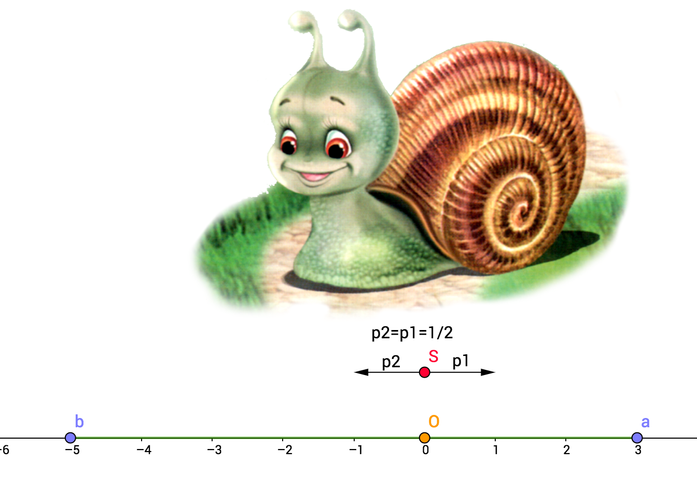

# Теорема об остановке мартингала (теорема Дуба) {#Doob_section}

Конспект: Дарина Шебзухова

дата: 26.11.2016

Пусть $X_t$ — наше благосостояние в справедливой игре в момент времени $t$ или мартингал.

Наша стратегия заключается в том, чтобы в нужный момент завершить игру, скажем, после
крупного выигрыша. Другими словами, наша стратегия определяется моментом остановки $\tau$.
Этот момент остановки — случайная величина, так как может зависеть от хода игры. 

Случайной величиной является также и $X_\tau$ — выигрыш на момент выхода из игры. Вопрос в том, чему равен средний выигрыш на момент прекращения игры, $E(X_\tau)$?

Ответ дает теорема Дуба: Если не ждать «слишком» долго, то каким бы хитрым ни был
момент остановки, ожидаемый выигрыш будет равен начальной сумме: $E(X_\tau ) = E(X_1)$.

## Пример не мартингала.{#Doob_subsection_1}

Сразу приведем пример «слишком» долгого ожидания: ждать до выигрыша в один рубль
в классическом случайном блуждании. 
Условие $E(X_\tau )$ = $E(X_1)$ здесь нарушено: выигрыш на момент выхода из игры равен одному рублю (по построению), а стартовая сумма равна
нулю. 
Почему это слишком долгое ожидание? Потому, что в этом случае можно доказать, что $E(\tau)$ = $+\infty$.
Точный смысл понятия «слишком» долго можно увидеть в теореме:

## Теорема 1. {#Doob_subsection_2}

Если $Xt$ --- мартингал, $\tau$ --- момент остановки, и выполнено хотя бы одно из
трёх условий:

1. Момент $\tau$ ограничен, то есть $\exists M$: $\tau$ < $M$. (Иными словами: гарантированно играем не больше $М$ шагов) 

1. $P(\tau < \infty) = 1$  $(P(\tau=+\infty)=0)$ и процесс $X_{t∧\tau}$ ограничен, то есть $\exists M$  : $\forall t$ $|X_{t∧\tau} | < M$ 
(момент $\tau$ может быть  $\forall$, главное, чтобы сам мартингал был не очень большой – рамки, которые ограничивают процесс) 

1. $E(\tau) < +∞$ и $\exists  M$: $\forall t$ верно $E(|X_{t+1} −X_t||\mathcal{F}_t) < M$ (процесс сильно "не скачет" за единицу времени)

 Замечание: 

В большинстве случаев этих критериев достаточно для практического применения мартингала

4. $P(\tau < \infty) = 1$, $E(|X_\tau |) < + \infty$ и $\lim_{t \to \infty}E(X_t|\tau >t) = 0$ : как следствие любого из трёх предыдущих

5. $P(\tau < \infty) = 1$ и мартингал $X_t$ является равномерно интегрируемым : используется определение равномерной интегрируемости 

То: $E(X_{\tau} )$ = $E(X_t)$ и, в частности, $E(X_\tau )$ = $E(X_1)$.

## Обобщая теорему {#Doob_subsection_3}

Если вы не заглядываете в будущее (не можете сказать,что выйдете из игры за минуту до проигрыша), т.е. играете в справедливую игру, то тогда ваш средний выигрыш на момент выхода из игры равен выигрышу на любой момент времени и, кроме того, равен стартовому состоянию.

## Задача 1 [В задачнике - 10.7] {#Doob_subsection_4}

### Условие задачи {#Doob_subsubsection_1}

В начальный момент времени в урне лежит 1 черный и 1 белый шар. В каждый момент времени из урны наугад извлекается один шар. Вместо одного извлеченного шара в урну кладут два шара такого же цвета.

Пусть $C_n$ - количество, а $M_n$- доля черных шаров после n-го шага.
Рассмотрим также величину $B_n$, показывающую, сколько раз из урны доставали черный шар к моменту времени n включительно.

1. Как связаны $B_n$ и $C_n$?

1. Докажите, что $M_n$ - мартингал.

1. Найдите $P(C_n = k)$

1. Как распределен $\lim_{n \to \infty}M_n$?

1. Докажите, что для $0 < \theta < 1$ мартингалом будет последовательность $N_n=(n+1)C_n^{B_n} \theta ^{B_n} (1-\theta)^{n-B_n}$

### Рассмотрим частные случаи:{#Doob_subsubsection_2}

$C_0=1$ - количество черных шаров перед первым извлечением шара

$C_1$---количество черных шаров после 1-го извлечения шара с соответствующими вероятностями (извлекли либо черный либо белый):

$C_1$|                   1                   |                   2                  |
-----|---------------------------------------|--------------------------------------|
p    |                  $\frac12$                  |                  $\frac12$                 |

$C_2$---количество черных шаров после 2-го извлечения шара с соответствующими вероятностями:

$C_2$|               1             |             2           |          3           |
-----|-----------------------------|-------------------------|----------------------|
p    |           $\frac12$  * $\frac23$         |        2 * $\frac13$  * $\frac13$   |       $\frac12$ * $\frac13$      |

Например,для $C_2=2$, т.е.когда после 2-го извлечения в коробке осталось два черных шара.

Могло быть:

1. На 1ом шаге извлекли белый (p=$\frac12$ ). В коробке: ББЧ. Тогда на втором шаге должны были извлечь черный (p=$\frac13$ ). В коробке: ББЧЧ($\frac12$ *$\frac13$ )

1. На 1ом шаге извлекли черный(p=$\frac12$ ). В коробке: БЧЧ. Тогда на втором шаге должны были извлечь белый (p=$\frac13$ ). В коробке: ББЧЧ ($\frac12$ * $\frac13$)

Тогда вероятность ББЧЧ= 2 * $\frac12$   * $\frac13$  = $\frac13$ 
            
Количество черных шаров после 3-го извлечения шара с соответствующими вероятностями:

$C_3$| 1                  | 2                 | 3                 | 4              |
-----|--------------------|-------------------|-------------------|----------------|
p | $\frac12$  * $\frac23$  * $\frac34$  | $\frac12$  * $\frac23$  * $\frac14$  + 2 * $\frac12$ * $\frac13$  * $\frac12$ | $\frac12$  * $\frac23$  * $\frac14$  + 2 * $\frac12$  * $\frac13$  * $\frac12$  | $\frac12$  * $\frac23$  * $\frac34$|

Предположим, что на каком-то шаге $P(C_n=k)=1/(n+1)$ --- гипотеза

$P(C_n=k)= \frac{P(C_n=k-1)*(k-1)}{(n+2)} + \frac {P(C_n=k)*((n+2)-k)}{(n+2)}$ :
либо было уже $k$ черных и добавили шарик другого цвета, либо было $(k-1)$ черный шар и на последнем шаге добавили еще один чёрный.

Тогда:
$P(C_n=k) = \frac1{(n+1)}*\frac {(k-1)}{(n+2)}+\frac 1{(n+1)}* \frac{((n+2)-k)}{(n+2)}$ = $\frac {(k-1+n+2-k)}{(n+1)(n+2)}=\frac {(n+1)}{(n+1)(n+2)}=\frac{1}{(n+2)}$.

$M_n$- доля чёрных шаров после $n$-го изъятия,

$M_1$| $\frac13$  | $\frac23$  |
-----|-----|-----|
p | $\frac12$  | $\frac12$  |

$M_{100}$|      $\frac1{102}$    |     $\frac2{102}$  |             ...            |       $\frac{101}{102}$ |
---------|--------------|-----------|----------------------------|------------------|
p        |    $\frac1{101}$    |     $\frac1{101}$  |             ...            |        $\frac1{101}$      |

Асимптотически напоминает равномерное распределение:
$\lim_{n \to \infty} M_n \sim U [0;1]$

Замечание:

Многие мартингалы сходятся к определённому распределению,если их отнормировать.

## Задача 2. [В задачнике -10.5] {#Doob_subsection_5}

###Условие задачи:{#Doob_subsubsection_1}

Пусть $S_n$ --- симметричное случайное блуждание, $S_0 = 0$.
Верно ли, что $Z_n = (−1)^n*\cos(\Pi*S_n)$ --- мартингал?

###Решение задачи:{#Doob_subsubsection_2}
Вспомним особенности функции $\cos$

$\cos(0)=1$

$\cos(\Pi)=-1$

$\cos(2*\Pi)=1$

$\cos(3* \Pi)=-1$

$S_0=0$ ; $S_1=1$ ; $S_2=0$...

$S_n$ меняет четность $\rightarrow$ посещаем $2*k*\Pi$ или $(2k+1)*\Pi$ $\rightarrow$ 
$\cos(2*k*\Pi )=1$ или $\cos((2k+1)*\Pi)=-1$;

$(-1)^n$: $(-1)^{2k}=1$, $(-1)^{2k+1}=-1$

 То есть множители всегда одного знака, следовательно, $Z_n=1$ всегда.
 Поэтому можно сделать вывод, что $Z_n$ --- мартингал. $\checkmark$
 
##Напоминалка:{#Doob_subsection_6}
 
 Говорим, что $Х$- подбрасывание монетки до 1-го выпадания "орла" ($Х \sim Geom(p)$), при этом "орел" выпадает с вероятностью $p$.
 
 
$X$        |       1          |          2          |       3         |      ...    |
-----------|------------------|---------------------|-----------------|-------------|
$P$        |       p          |        p * (1-p)    |    p* (1-p)^2   |      ...    |
 
 $E(X)=\frac1p$ 
 
 $P(X=+\infty)=(1-p)^\infty=0$
 
 Заметим, что геометрическое распределение удовлетворяет условиям теоремы Дуба!
 
 
## Задача 3. {#Doob_subsection_7}
(Симметричное случайное блуждание)
 
### Условие задачи:{#Doob_subsubsection_1}
 
  Улитка начинает свой путь в точке 0 и за каждую минуту равновероятно смещается влево или вправо на один сантиметр.
  
  Справа от улитки на расстоянии $a$ находится виноградное дерево, слева на расстоянии $b$ — шелковица.
  
$X_t$ --- координаты улитки после $t$ шагов.

Вопросы:

1. Применима ли теорема Дуба: $\bullet$ $X_t$- мартингал ли?$\bullet$  Если $\tau$ - момент залипания, то является ли $\tau$ моментом остановки? $\bullet$  $P(\tau=+\infty)=?$ и $E(\tau) \vee +\infty$ ?
1. Чему равна следующая вероятность $P(X_{\tau}=3)$ ?

1. Чему равно $E(X_{\tau})$?

1. Является ли мартингалом процесс: $Y_t=X_t^2-t?$

1. Является ли мартингалом процесс: $\widetilde{Y_t}=\widetilde{X_t}^2-t$ ?

### Решение:{#Doob_subsubsection_2}

Пусть для простоты $а=3$ $b=-5$

1. Проверка выполнения условий теоремы Дуба:
* $E(X_{t+1}|\mathcal{F}_t)$:
$\bullet$ Если улитка уже залипла на шаге $t$,то $X_t=3$ или $X_t=5$, тогда остается и дальше на текущей позиции, т.е. $E(X_{t+1}|\mathcal{F}_t)=X_t$

$\bullet$ Если после $t$ идет направо, то $X_{t+1}=X_t+1$; 
или после $t$ идет налево  $X_{t+1}=X_t-1$, то есть на шаге $t$ еще не залипла то $E(X_{t+1}|\mathcal{F}_t)=\frac12 * (X_t+1) + \frac12 *(Xt-1)=X_t$

!Следовательно, вне зависимости от того, зависла ли улитка на предыдущем шаге или нет $E(X_{t+1}|\mathcal{F}_t)=X_t$ $\rightarrow$ $X_t$ --- мартингал. $\checkmark$

* $\tau$ - момент залипания, он действительно ограничен например числом $|8|$ $\rightarrow$ $\tau$ ---  момент остановки $\checkmark$

* $P(\tau=+\infty)=?$ и $E(\tau) \vee +\infty$

$\bullet$ Рассмотрим $P(\tau=+\infty)$.

Есть, вообще говоря, $\infty$ количество траекторий, что улитка никогда не залипнет.
Разобьем жизнь улитки на периоды по 8 шагов ("восьмидневки"). Если все 8 дней улитка будет двигаться в одном направлении, то она точно залипнет, но не факт, что она залипла, если нет такой "восьмидневки".

Вероятность того, что конкретная "восьмидневка" в одну сторону: $(\frac12)^8$,

Вероятность того, что конкретная "восьмидневка" НЕ в одну сторону:$1-(\frac12)^8$

Для всех "восьмидневок": $(1-(\frac12)^8)^\infty$ - вероятность того, что все "восьмидневки" "несчастливые".
Тогда $1-(1-(1/2)^8)^\infty \le P( "залипла")$ $\rightarrow$

$P("залипла") \ge 1$

$P("залипла") = 1$ 

$P(\tau=+\infty)=0$ $\checkmark$
 
$\bullet$ $E(\tau) \vee +\infty$

$\tau \le 8* N1$

$N1$-номер 1-ой счастливой восьмидневки, $N1 \sim Geom(1/2)$

$E(\tau) \le 8* E(N1)$

$E(N1)=2^8 \rightarrow E(\tau) \le 8* 2^8$ - конечное

$E(\tau)$ ограничено

2. п.1- не применим, т.к. момент залипания не ограничен;

п.2: $|X_{t \wedge \tau|}|<6$ , т.к. положение улитки ограничено координатами точек "залипания" $\rightarrow$ пункт применим $\checkmark$ 

п.3.$E(\tau)$ ограничено (из пункта в) 

$|X_{t+1 \wedge \tau}-X_{t \wedge \tau|}|<2$ ( точно меньше 2: если залипнет = 0, если не залипнет, то = 1) $\checkmark$

$\bullet$ $P(X_{\tau}=3)$ - вероятность того, что улитка дойдет до виноградника

$E(X_1)=-1*\frac12+1*\frac12=0$

$E(X_\tau)=E(X_1)=0$ (т.к. $X_t$- мартингал)

тогда $E(X_\tau)= 3*p + (1-p)*(-5)=0$ 

$\rightarrow 8*p-5=0 \rightarrow p=\frac58$

$P(X_{\tau}=3)=\frac58$

3. $E(X_\tau)=E(X_1)=0$ (т.к. $X_t$- мартингал)

4. $Y_t=X_t^2-t?$ - не мартингал:

если залипла, то $X_t^2$ не меняется, а t продолжает меняться

5. $\widetilde{Y_t}=\widetilde{X_t}^2-t$

$\widetilde{X_t}$- координаты улитки, если бы не было залипания;

$\bullet$ $E(\widetilde{Y_{t+1}}|\mathcal{F}_t)$=
$E({\widetilde{X_{t+1}}}^2|\mathcal{F}_t)$-
-$(\widetilde{t}+1)|\mathcal{F}_t)$ 
$E(\widetilde{Y_{t+1}}|\mathcal{F}_t)$ = 
=$E((\widetilde{X_t}+\Delta_{t+1})^2)|\mathcal{F}_t)- \widetilde{t}-1$=
= $E(\widetilde{X_t}^2
+2*\widetilde{X_t}*\Delta_{t+1}+{\Delta_{t+1}}^2|\mathcal{F}_t) -\widetilde{t}-1$
${\Delta_{t+1}}^2=1$

$E(\widetilde{Y_{t+1}}|\mathcal{F}_t)$= 
$E(\widetilde{X_t}^2 +2*\widetilde{X_t}*\Delta_{t+1}|\mathcal{F}_t) - \widetilde{t}$=
=$\widetilde{X_t}^2+2*\widetilde{X_t}*E(\Delta_{t+1}|\mathcal{F}_t)) -\widetilde{t}$
[в силу независимости переходим к безусловному математическому ожиданию]

$E(\Delta_{t+1}|\mathcal{F}_t))=E(\Delta_{t+1})=1/2*(-1)+1/2*1=0$
$E(\widetilde{Y_{t+1}}|\mathcal{F}_t)=$
$\widetilde{X_t}^2-\widetilde{t}=\widetilde{Y_t}$
$\rightarrow$ $\widetilde{Y_t}$ --- мартингал $\checkmark$
$\rightarrow$ можно применить теорему Дуба!

п1: $\tau$ может принимать очень большие значения

п2: $|\widetilde{Y}_{\tau \wedge t}|<m?$

m --- конкретное число

$\widetilde{Y}_{\tau \wedge t} = {\widetilde{X}_{\tau \wedge t}^2}-t\wedge\tau$

$\bullet$ ${\widetilde{X}_{\tau \wedge t}^2}\in ([-5;3]^2)$

$\bullet$ $t\wedge\tau$ не ограничено

$|\widetilde{Y}_{\tau \wedge t}|<m$ 

п.3: 

$|\widetilde{Y}_{t+1\wedge\tau}-\widetilde{Y}_{t\wedge\tau}|= |\widetilde{X}_{t+1\wedge\tau}^2-[(t+1)\wedge\tau+t\wedge\tau]-\widetilde{X}_{t\wedge\tau}^2|$

$\widetilde{X}_{t+1\wedge\tau}^2 \le 25$

$\widetilde{X}_{t\wedge\tau}^2 \le 25$ 

$t+1\wedge\tau$ и $t\wedge\tau$ отличаются максимум на 1

$|\widetilde{Y}_{t+1\wedge\tau}-\widetilde{Y}_{t\wedge\tau}| \le 100$ (гарантировано)

$\rightarrow$ теорема Дуба применяется 

$E(\widetilde{Y}_t) = E(\widetilde{Y}_1)= E(\widetilde{X}_1^2-1)=E(1-1)=0$

$\widetilde{X}_1 = 1 (или = -1)$

$E(\widetilde{X}_\tau^2-\tau)=E(\widetilde{X}_\tau^2)-E(\tau) = 9*\frac58+25*\frac38-E(\tau) = 0$ $\rightarrow$ 

$E(\tau)=\frac{(45+75)}8=\frac{120}8=15$

