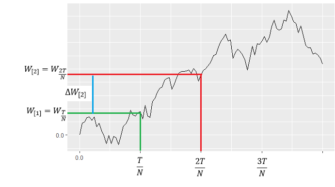

# Броуновское движение в R и стохастические интегралы

Конспект: Яковлева Ирина

дата: 02 декабря 2016

## Подготовительные шаги{#Brownian_motion_pre_section_1}

### Какой пакет необходим для того, чтобы построить траекторию броуновского движения в R? Как его установить?{#Brownian_motion_pre_subsection_1}

Нам понадобится коллекция $tidyvers$, которая включает набор инструментов для обработки данных. Чтобы установить пакет в $R$, воспользуемся функцией $install.pakages$("название пакета"). А чтобы включить пакет используем $library$("название пакета").

```{R,"packages"}!
install.packages("tidyverse")
library("tidyverse")
```

### Как генерировать вектора случайных величин с заданным распределением в R?{#Brownian_motion_pre_subsection_2}

Чтобы генерировать вектора нормально распределённых случайных величин (они по умолчанию полагаются независимыми), можно использовать функцию $rnorm(N, \mu, \sigma)$, где $\mu$ — математическое ожидание, $\sigma$ — стандартное отклонение (не дисперсия), а $N$ — длина вектора.
Например, хотим создать вектор длины $5$ из независимых нормально распределённых случайных величин с математическим ожиданием $2$ и стандартным отклонением $1$.
```{R, "work_rnorm"}
rnorm(5, mean = 2, sd = 1)
```
*Бонус!*
Можно ещё генерировать вектора случайных величин с экспоненциальным распределением. Для этого понадобится $rexp$, с распределением Пуассона — $rpois$, и так далее. Можно создать вектор случайных величин с практически любым распределением.

### Еще одна важная функция cumsum {#Brownian_motion_pre_subsection_3}

Чтобы найти куммулятивную сумму воспользуемся $сumsum(a)$, она работает следующим образом: первый элемент вектора $b$ — тот же, что и в $а$. А дальше каждый $n$-ый элемент вектора $b$ является суммой $n-1$ предыдущих элементов $а$.
```{R, echo=TRUE, "work_cumsum"}
a <- c(0.2, -0.1, 0.3, 0.1)
a
cumsum(a)
```

### Как сделать случайные последовательности не совсем случайными? {#Brownian_motion_pre_subsection_4}

Ещё нам понадобится $set.seed$(любое число). Эта функция помогает, испльзуя генератор случайных последовательностей, получать идентичные последовательности чисел при неоднократном прогоне программы. Посмотрим, что получается:

```{R, "work_set.seed"}
set.seed(1000)
rnorm(5, mean = 2, sd = 1)
```

И ещё раз:

```{R,"work_set.seed2"}
set.seed(1000)
rnorm(5, mean = 2, sd = 1)
```

## Работа в R c броуновcким движением{#Brownian_motion_work_section_2}

### Как построить траекторию броуновского движения?{#Brownian_motion_work_subsection_1}

Построим график броуновского движения до на интервале $[0;\,2]$. Разобъём интервал от $[0;\,2]$ на много-много интервальчиков, например на 1000. В броуновском движении приращения являются независимыми случайными величинами, $\Delta W_i \sim N(0;\frac{T}{N}),\,\Delta W_i = W_i - W_{i-1}$ (в коде обозначаются $dw$), где $W_i$ - значение броуновского движения в момент времени $i$.




```{R, echo=TRUE, message=FALSE, "trajectory_Browian_motion"}
library("tidyverse")
T <-  2 
# До какого момента строим броуновское движение
n_points <- 100 
# Число точек
dt <-  T / n_points 
# Длина одного промежутка
set.seed(322223322) 
# Чтобы при нескольких прогонах программы генерировалась одна и та же последовательность
dW <-  rnorm(n_points, mean = 0,
            sd = sqrt(dt)) 
# Вектор случайных величин с нормальным распределением, каждый его элемент приращение броуноского движения за  1 момент
W1 <- cumsum(dW) 
# Каждый элемент вектора соответствет значению броуновского движения в определенный момент времени
time1 <- seq(from = dt, to = T, by = dt) 
# Вектор моментов времени
time <- c(0, time1)
W <- c(0, W1) 
# Броуновское движение начинается с нуля!
qplot(x = time, y = W, geom = "line")
```

##13.2.2 Упражнение{#Brownian_motion_work_subsection_2}

1. Найти площадь под $W^2_t$.

**Идея:**

Чтобы найти площадь под $W_t$, надо найти $S=\int\limits_0^2W_t\,dx$, а для этого можно перейти к сумме площадей прямоугольничков $S_i=W_i \cdot \Delta{W_i}$.

```{R, "exercise_1"}
library("tidyverse")
T <- 2 
# До какого момента строим броуновское движение
n_points <- 100 
# Число точек
dt <- T / n_points 
# Длина одного промежутка
set.seed(322223322) 
# Чтобы при нескольких прогонах программы генерировалась одна и та же последовательность
dW <- rnorm(n_points, mean = 0,
            sd = sqrt(dt)) 
# Вектор случайных величин с нормальным распределением, каждый его элемент приращение броуноского движения за  1 момент
W1 <- cumsum(dW) 
# Каждый элемент вектора соответствет значению броуновского движения в определенный момент времени
time1 <- seq(from = dt, to = T, by = dt) 
# Вектор моментов времени
time <- c(0, time1)
S <- sum(dt * W1^2) 
# Находим приближенно площадь, суммируя прямоугольнички, ширина которых dt, а длина w1^2
S
```

2. Найти $E(S)$ и $p(S>3)$

**Идея:** Много раз найти площадь S, чем больше, тем лучше.

```{R, "exercise_2"}
library("tidyverse")
T <- 2 
# До какого момента строим броуновское движение
n_points <- 100 
# Число точек
dt <- T / n_points 
# Длина одного промежутка
set.seed(322223322)
# Чтобы при нескольких прогонах программы генерировалась одна и та же последовательность
dW <- rnorm(n_points, mean = 0,
            sd = sqrt(dt)) 
# Вектор случайных величин с нормальным распределением, каждый его элемент приращение броуноского движения за  1 момент
W1 <- cumsum(dW) 
# Каждый элемент вектора соответствет значению броуновского движения в определенный момент времени
time1 <- seq(from = dt, to = T, by = dt)# Вектор моментов времени
time <- c(0, time1)
n_exp <- 500 
# Число эксперементов, чем больше, тем лучше
all_S <- rep(0, length.out = 500) 
# Вектор необходим для сохранения S
for (i in 1:n_exp) {
  dW <- rnorm(n_points, mean = 0,
              sd = sqrt(dt))
  W1 <- cumsum(dW)
  S <- sum(dt * W1^2)
  all_S[i] <- S 
} 
# Цикл необходим, чтобы несколько раз подсчитывать площадь
mean(all_S) #  E(S)
sum(all_S > 3) / n_exp  # p(S > 3)

```

## 13.3 Стохастические интегралы{#stoch_section_3}

### 13.3.1 Финансовая интерпретация интеграла:{#stoch_subsection_1}

$\int\limits_0^1A(t)\,dB(t)$ — прибыль от владения активом за время от $0$ до $1$, если $A(t)$ — количество актива в момент времени $t$; $B(t)$ — цена актива в момент времени $t$.

### 13.3.2 Простые упражнения:{#stoch_subsection_2}

1. $\int\limits_2^79\,dW_t=9W_7-9W_2$ (количество актива не меняется, $W_t$ — цена актива в момент времени $t$).

2. $\int\limits_0^33\,dt=9-0=9$ (количество актива тоже не меняется, в момент времени $t$ актив стоит $t$).

### 13.3.3 Пример в R {#stoch_subsection_3}

Найти $p(Z>1)$, если $Z=\int\limits_0^2W^2_t\,dW_t$.


```{R,"stoch"}
library("tidyverse")
T <- 2 
# До какого момента владеем активом
n_points <- 100 
# Число точек
dt <- T / n_points 
# Длина одного промежутка
set.seed(322223322) 
# Чтобы при нескольких прогонах программы генерировалась одна и та же последовательность
n_exp <- 500 
# Число эксперементов
all_Z <- rep(0, length.out = 500) 
# Вектор, куда будут запоминаться значения прибыли
for (i in 1:n_exp) {
  dW <- rnorm(n_points, mean = 0,
              sd = sqrt(dt)) 
  # Вектор изменений цены актива
  W1 <- cumsum(dW) 
  # Элементы соответствуют цене актива в определеный момент времени
  W_star <- W1[-n_points]
  dW_star <- dW[-1]
  Z <- sum(dW_star * W_star^2)
  all_Z[i] <- Z
}

sum(all_Z > 1) / n_exp